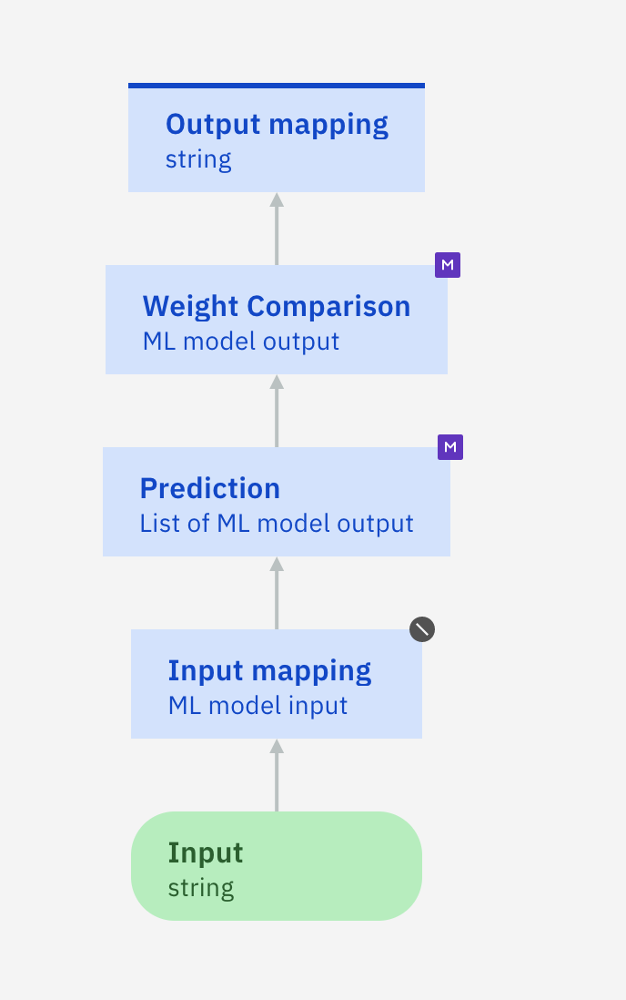
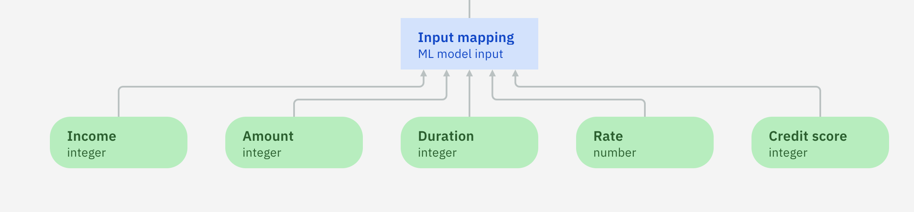

# Sample: Import PMML files to create transparent predictive models

This directory contains PMML files with rulesets. These files were generated using different algorithms from AI Explainability 360 and Watson Studio Modeler Flow (SPSS Modeler).

## Using PMML files with rulesets

The files can be directly imported into Decision Designer to generate a transparent predictive model. In a transparent predictive model, predictions are made by evaluating the imported rules -- whereas remote black-box models need to be invoked to return a prediction.

### Creating a transparent predictive model

You create a predictive model and configure it using a PMML file. For more details, see the [documentation](https://www.ibm.com/docs/en/cloud-paks/cp-biz-automation/22.0.1?topic=model-importing-rule-based-machine-learning).
The first step is to download the PMML file to your machine. Then, open Decision Designer to upload it:

   * Create a decision service in Decision Designer.
   * Create a predictive model.
   * Click `Configure`.
   * Select `Local machine learning` as the configuration method and click `Next`.
   * Browse to the PMML file on your machine or drag and drop it. Then, click `Apply`. 
       
   * Explore the created predictive model: click the `Prediction` node and and open the `Logic` tab to see the generated rules. 
   * Go back to the diagram.
   
You now need to define and map input data.
 
### Mapping input data
You check what input data is required and create a mapping rule.
   * Click the `Input mapping` node and create a business rule named `mapInputData`: you can see all the input data required to run the model.
   * Hover over each placeholder to see the expected data type for each input. For example, take the `miniloan` PMML model. The generated rule should be as follows:
    
    Leave the business rule as is and go back to the diagram.
   * Define all the required input nodes and assign the correct data type to each one of them. The following screenshot shows the diagram complete with input nodes for the `miniloan` model:
    
   * Reopen the `mapInputData` rule and fill the placeholders using all the newly created input nodes. For the `miniloan` model, the rule should be as follows:
   ```
   set decision to a new ML model input where
   		the creditscore is 'Credit score' , 
   		the income is Income , 
   		the loanamount is Amount , 
   		the monthduration is Duration , 
   		the rate is Rate ;
```
You could also define composite data types, such as a `loan` and a `borrower`, to collect and hold the data needed to run the prediction rule. 

**Note**: The `ML model input` type is automatically generated from the PMML dictionary when the rules are imported. You can look at the content of the  `DataDictionary` section in the PMML file to see how it is defined. 

### Mapping output data
You create the output mapping rule.

   * Go back to the diagram and open the `Output mapping` node.
   * Create a rule named `mapOutputData` and fill it in so that it returns a prediction only when the confidence and weight are appropriate. For example:
```
   if
     the confidence of 'Weight Comparison' is more than 0.7
   then
     set decision to the predicted of 'Weight Comparison' ;
```
### Testing the model

You run the predictive model to make sure it works as expected.
   * Open the `Run` tab and create a test data set. For example, for the `miniloan` model:
   ```
   {
     "amount": 10000,
     "creditScore": 200,
     "duration": 72,
     "income": 100000,
     "rate": 0.7
   }
```
   * Run the model. It returns a prediction.

## Files details
You can find some information about each file available in this directory below.

### Iris
This ruleset was built using the [iris.data](datasets/iris.data) and [iris.names](datasets/iris.names) data sets.
It predicts the family name of an iris depending on the length and width of the petals and sepals of the flower.

### Churn
This ruleset was built using the [churn.csv](datasets/churn.csv) data set.
It is used in the `Telecom` sample and predicts if a customer is likely to churn.

### LTVdiscrete
This ruleset was built using the [LTVdiscrete.csv](datasets/LTVdiscrete.csv) data set.
It is used in the `Telecom` sample and predicts a customer lifetime value. 

### Miniloan
This ruleset was built using the [miniloan.csv](https://github.com/DecisionsDev/decisions-on-spark/blob/master/data/miniloan/miniloan-decisions-ls-10K.csv) data set.
It predicts if a loan is likely to be approved.

### Wifi
This ruleset was built using the [wifi.txt](datasets/wifi.txt) data set.
It predicts the wifi signal in a specific location.
