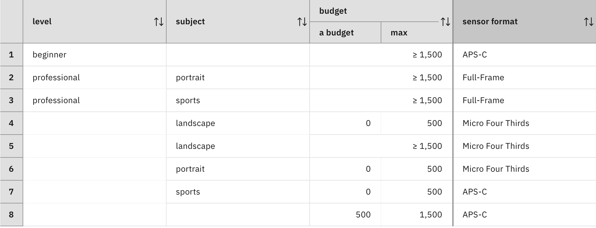

### Making a decision by a single rule

As explained in the [Discussion of decision models](../../DecisionModeling/wrapup/description.md), each decision node has a decision logic that determines a unique value for the decision node based on the values of its direct predecessors in the dependency diagram. The decision logic can only use the values of these direct predecessors for this purpose and no other information. Different combinations of predecessor values correspond to different cases that the decision logic must consider:

1. **Completeness**: For each of these cases, the decision logic must determine a value for the decision node (or a list of values if the decision node is multi-valued).
2. **Consistency**: When the decision logic encounters the same case several times in different scenarios, it must always determine the same value for the decision node (or the same list of values if the decision node is multi-valued) in these scenarios.

How can these two requirements be achieved by a decision logic that consists of a list of rules?

Rules can take different forms and can exhibit complex behavior. In the following, assume that the rules of the decision logic have a particular form:

> Each rule should be able to determine a value for the decision node based on the available information (that means the values of the direct predecessors of the decision node) for all cases in which this rule is applicable.

Such a rule includes a condition that defines when the rule is applicable and an action that sets the value of the decision node. When the rule is applied, its action determines the value of the decision node but does not alter the values of its direct predecessors. Therefore, applying one of the rules does not change the applicability of the other rules of the decision logic. As a consequence, all rules are independent of each other based on the assumption made above.

Hence, a decision is made by a single rule under this assumption. Although this assumption is quite strong and will be relaxed in a later step, it is not easy to ensure that a unique decision is obtained for each possible case.

This will be illustrated for the decision node `sensor format`, which has the direct predecessors `level`, `subject`, and `budget`. The following decision table provides a decision logic for sensor format. It is a variant of the decision table considered before.

This decision table does not determine a sensor format for beginners with high budget who want to do sports or portrait photography. As such, a decision logic that just consists of this decision table does not meet the completeness requirement listed above.

The following decision table is similar to the previous one, but has an additional row. This row chooses an APS-C sensor for beginners with high budget:
 

According to this decision table, beginners in landscape photography with high budget may receive an APS-C sensor according to the first row and a Micro Fourth Third sensor according to the fifth row. Hence, a decision logic that consists of this decision table may choose different values for the decision node in different scenarios. It does not meet the consistency requirement listed above.

The next decision table is similar to the previous one, but the first row is replaced by two rows that specify different values for subject. None of these new rows are applicable to beginners in landscape photography with high budget.

This example meets the completeness and consistency requirements. In each case, exactly one row is applicable and determines a value of the decision variable.

Hence, one way to meet the requirements is to use rule sets that are complete and have no overlaps between the sets of cases in which one rule is applicable and the sets of cases in which another rule is applicable. In each case, exactly one rule is applicable. Other methods for meeting the completeness and consistency requirements will be considered in a subsequent step.

How can it be determined that a rule set is complete and without overlap? This problem can be solved by a rigorous logical analysis of the rule conditions. For a small number of dimensions, this can, for example, be achieved by a diagram showing all cases and by marking them with rules that are applicable in those cases. The following diagram shows all possible cases for level, subject, and budget in different cells. Each cell is marked by the numbers of rows that are applicable in the corresponding case (and also shows the sensor format determined by that row):

As each cell shows exactly one row number, the corresponding decision table is complete and without overlaps.

For a larger number of dimensions, this logical analysis can be carried out if the rules are organized in a tree-like manner and each rule corresponds to a branch in a tree. For example, cells within a column of a decision table can be grouped together if their left neighbors are also grouped together and have the same values. This allows cells in decision tables to be structured in a tree-like organization. If none of the cells are empty, it is possible to determine missing cases and overlaps by analyzing the tree.

In all other cases, a rigorous logical analysis of rule conditions in order to determine missing cases and cases with multiple applicable rules is a difficult problem. It may even be difficult for small rule sets, as shown in the above examples.

#### Exercise: Incomplete DT

Create a diagram with a decision node for sensor format that depends on three input data nodes for level, subject, and budget as in Section [Making intermediate decisions](../../DecisionModeling/step4/description.md). 

Create a decision logic for sensor format that consists of the decision table “Incomplete DT” described above.

> Tip: You can duplicate the decision service that contains the decision model developed in [Making intermediate decisions](../../DecisionModeling/step4/description.md) to save some time.

Prepare a test data set in the Run tab where the level is beginner, the subject is portrait, and the budget is 3000. Run the data set and look at the output. Is a sensor format proposed?

Try to understand the response by preparing a diagram that shows all cases and marking all the cells with the number of all the rows that are applicable in the decision table. Did you label all the cells with a row number?

#### Exercise: DT with overlaps

Create a decision logic for the sensor format that consists of the  decision table “DT with overlaps” described above. Ensure that `First rule applies` is selected in the logic view of the `sensor format` node.

Prepare a test data set in the Run tab where the level is beginner, the subject is landscape, and the budget is 3000. Run the data set and look at the output. Take a look at the sensor format that is proposed.

Go back to the Logic view and choose `Rules are applied in sequence` in the drop-down menu. Run the data set again. Do you get the same sensor format as for `First rule applies`?

Try to understand the response by preparing a diagram that shows all cases and marking all the cells with the number of all the rows that are applicable in the decision table. Did you label all the cells with a single row number?

#### Exercise: Complete and overlap-free DT

Create a decision logic for the sensor format that consists of the decision table “complete and overlap-free DT” described above. Ensure that `First rule applies` is selected in the logic view of the `sensor format` node.

Prepare a test data set in the Run tab where the level is beginner, the subject is portrait, and the budget is 3000. Run the data set and compare the output with the one you got in [Exercise: Incomplete DT](#exercise-incomplete-dt). Has the problem been fixed?

Prepare a test data set in the Run tab where the level is beginner, the subject is landscape, and the budget is 3000. Run the data set with the `First rule applies` first. Then, run it again with the `Rules are applied in sequence` policy. Compare the output with the one you got in  [Exercise: DT with overlaps](#exercise-dt-with-overlaps). Has the problem been fixed?

#### Lessons learned

Complete and overlap-free rule sets provide a first way to meet the completeness and consistency requirements of a decision logic. A decision logic based on a _complete and overlap-free rule set_ has the following characteristics: 

1. Each rule is able to make a decision alone, based on the information that is available, for all the cases where the rule is applicable.
2. Exactly one rule is applicable in each case.

#### Limitations

It is difficult to determine that rules do not overlap and cover all cases. The next steps will show how to define a decision logic with a rule set, even if rules are overlapping and not covering all cases. [Continue the tutorial](quiz/quiz.md)

[Back to Decision logic step by step](../README.md)
