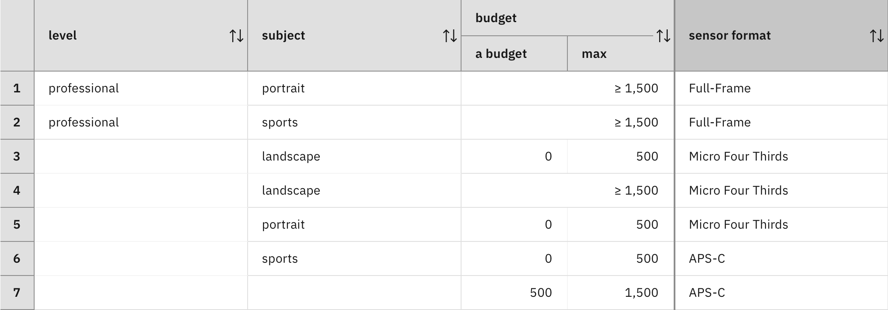
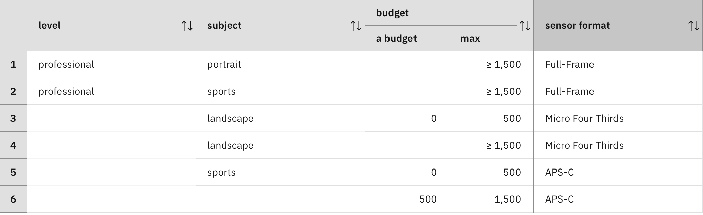

### Ensuring completeness

A decision logic has to determine a value for its decision node for each case that may arise. If the decision logic is expressed with rules, making sure that every case is covered is not evident. A rule determines a value of the decision node only for those cases in which it is applicable. A complete decision logic thus requires that in each case at least one of the rules is applicable.

How can an incomplete rule set be made complete? There are two fundamentally different ways to solve this problem. You can either specify a default value that is used as a fallback when no rule is applicable, or refine the decision logic by computing missing rules.

In ADS, default values are defined with default rules. A decision logic cannot have more than one default rule. A default rule has no condition and is applied if none of the regular rules or decision tables are applicable. Its action sets the value of the decision node to the default value.

Consider the incomplete decision table from [Step 1](../step1/description.md).



The following default rule specifies APS-C as default value, which is used if none of the rows are applicable:

```
set decision to APS-C ;
```

For beginners with high budget who want to do sports photography, none of the rows are applicable. The default rule is therefore applied and determines APS-C as the sensor format. The same happens for beginners with budget interested in portrait photography. The default rule sets the decision variable to the same value for all missing cases.

While a decision logic with default rules satisfies the completeness requirement, this approach comes at a cost. The same decision will be used for all cases that are not covered by the regular rules. It is not possible to differentiate between those cases. This can be illustrated with a variant of the previous decision table, where you remove the fifth row of the table (that covers portrait photography and low budget):



This new decision table has two families of missing cases:

1. Beginners in sports or portrait photography with high budget.
2. Photographers in portrait photography with low budget.

Suppose that default value APS-C is suitable for the first case, but not for the second case for which Micro Fourth Third should be chosen. Therefore, it is not sufficient to specify a default value. The decision logic needs to be refined by missing rules.

As indicated in [Step 1](../step1/description.md), finding missing rules is a difficult problem, even for small rule sets. ADS provides a tool for computing missing rules based on a logical rule analysis. Clicking on the magic wand in the Logic view launches this computation. For the decision table with two missing cases, three missing rules are generated.

> Note: the completeness analyzer computes missing rules for the whole decision logic, which may consist of multiple rules and decision tables. Therefore, the generated missing rules are not associated with a particular decision table and are not integrated as additional rows.

The first missing rule covers budgets less than zero and can be ignored. Budgets cannot be negative. However, ADS does not provide a way to specify this information.

```
if
    budget is less than 0
then
    -- This is a generated rule. Choose a meaningful value for the decision variable.
    set decision to APS-C ;
```

The second missing rule describes the second case listed above (photographers in portrait photography with low budget). The generated missing rule has a meaningful condition, but no meaningful action. ADS simply puts in the default value of the type of the decision node. For sensor format, this is APS-C. The generated rule has a comment inviting the rule author to choose a meaningful value:

```
if
    subject is not sports
    and subject is not landscape
    and budget is less than 500
then
    -- This is a generated rule. Choose a meaningful value for the decision variable.
    set decision to APS-C ;
```

As discussed above, Micro Fourth Third should be used for this missing rule. Therefore, APS-C has to be replaced by Micro Fourth Third. After that, the comment can be removed and the missing rule can be approved (see the corresponding action in its dropdown menu in the rule list). Approving the missing rule adds it to the rule set of the decision logic, helping refine the decision logic.

```
if
    subject is not sports
    and subject is not landscape
    and budget is less than 500
then
    set decision to Micro Four Thirds ;
```

The remaining missing rule describes a case that can be covered by the default value of the decision logic. As a result, it is not necessary to approve it and to add it to the rule set of the decision logic. 

```
if
    subject is not landscape 
    and level is not professional 
    and budget is at least 1500
then
    -- This is a generated rule. Choose a meaningful value for the decision variable.
    set decision to APS-C ;
```

There is a benefit to using a regular rule instead of a default rule. A regular rule has an explicit condition whereas a default rule has an implicit one, namely that none of the other rules could be applied. The explicit condition is more informative when explanations for a decision are requested. These explanations specify which rules have been applied to determine the value of the decision variable. The user can then understand the conditions that allowed the application of these rules. Regular rules clearly show those conditions, whereas default rules don’t. If clear explanations are required, it is better to approve the missing rules, even if the default rule produces the same result.

#### Exercise: Default Value

Create a diagram with a decision node for sensor format that depends on three input data nodes for level, subject, and budget as in Section [Making intermediate decisions](../../DecisionModeling/step4/description.md).

Create a decision logic for sensor format that consists of the decision table “DT with one missing case” described above.

Prepare a test data set in the Run tab where the level is beginner, the subject is portrait, and the budget is 3000. Run the data set and look at the output. Is a sensor format proposed?

Add a default rule to the decision logic that sets the decision variable to “APS-C”. Run the scenario again. Is the same sensor format obtained?

Expand the `sensor format` entry in the run history. Which rule determined the sensor format value?

#### Exercise: Missing Rules

Create a decision logic for sensor format that consists of the decision table “DT with two missing cases” described above and a default rule that sets the decision variable to “APS-C”.

Prepare a test data set in the Run tab where the level is professional, the subject is portrait, and the budget is 400. Run the data set and look at the sensor format that has been proposed.

In the Logic view of `sensor format`, click the magic wand to generate missing rules. This should generate three missing rules as described above. In the following missing rule, replace “APS-C” with “Micro Fourth Third”:

```
if
    subject is not sports
    and subject is not landscape
    and budget is less than 500
then
    -- This is a generated rule. Choose a meaningful value for the decision variable.
    set decision to APS-C ;
```

Approve the missing rule and run the test data set again. Is the same sensor format obtained as before?

Expand the `sensor format` entry in the run history. Which rule determined the sensor format value?

#### Lessons learned

A decision logic based on an _overlap-free rule set and default value_ has the following characteristics:

1. Each rule is able to make a decision alone, based on the information that is available, for all the cases where the rule is applicable.
2. At most, one rule is applicable in each case.
3. The default value is used if no rule is applicable.

ADS allows the generation of missing rules if the default value cannot be used for all missing cases.

#### Limitations

In some decision-making problems, cases are infeasible and no decision can be made. It is not meaningful in this case to specify a default value as it would provide a decision for infeasible cases. In a similar way, generating missing rules would not be meaningful since no decision can be made for infeasible cases. The next step extends decision logic requirements to allow for incompleteness. [Continue the tutorial](quiz/quiz.md)

[Back to Decision logic step by step](../README.md)
