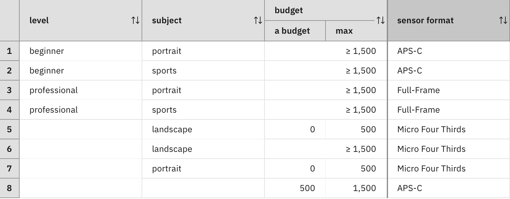

### Undefined decisions

As shown in the previous section, an incomplete rule set can be made complete by either specifying a default value or by generating missing rules. When a rule set is complete, a decision can be made in all cases. However, there are also problems where a decision cannot be made for all cases.

Consider a variant of the complete and overlap-free decision table from [Step 1](../step1/description.md), where you remove the sixth row of the table (that covers sports photography and low budget).

Sports photography requires an APS-C or full-frame sensor. If those are not available for a low budget, no sensor format can be determined. As a consequence, the decision is undefined. 

Decision-making problems that allow undefined decisions have slightly different properties than that described in the [Discussion of decision models](../../DecisionModeling/wrapup/description.md): after decision making, each input data node and each decision node must have a value or _be undefined_.

This requires an adjustment of the dependency diagram properties.

1. Each single-valued node has a value or is undefined. This constitutes the evaluation of the node.
2. If a single-valued node has a value, then this value belongs to the data type of the node.
3. The evaluation of the direct predecessors of a single-valued decision node in the dependency diagram determines whether the decision node has a value or is undefined. In the former case, it uniquely determines the value for the decision node.

Multi-valued nodes can be undefined as well and this is different to having an empty list of values:

1. Each multi-valued node has a (possibly empty) list of values or is undefined. This constitutes the evaluation of the node.
2. If a multi-valued node has a list of values, then each of these values belongs to the data type of the node.
3. The evaluation of the direct predecessors of a multi-valued decision node in the dependency diagram determines whether the decision node has a list of values or is undefined. In the former case, it uniquely determines the list of values for the decision node.

Given this, the completeness requirement of a decision logic can be relaxed and the consistency requirement needs to be adapted:

1. **Completeness under undefined decisions**: For each of the cases, the decision logic must determine a value for the decision node (or a list of values if the decision node is multi-valued) or mark the decision as undefined.
2. **Consistency under undefined decisions**: When the decision logic encounters the same case several times in different scenarios, it must always determine the same value for the decision node (or the same list of values if the decision node is multi-valued) or always mark the decision as undefined in those scenarios.

Supposing that the rules are overlap-free, these requirements can be satisfied using the following method, which gives applicable rules priority over marking the decision as undefined:

> If the decision logic consists of a set of rules, it will mark the decision as undefined for a given case if no rule is applicable and no default rule has been specified.

A decision logic cannot determine a value for its decision node in one scenario and mark it as undefined for the same case in another scenario. The value in the first scenario was determined by a rule that is also applicable in the second scenario, since both scenarios involve the same case.

If nodes can be undefined, what does it mean for the direct predecessors of a decision logic? It leads to new cases where one or more predecessors are undefined. If a decision logic does not take these additional cases into account, it will simply mark the decision node as undefined if one of its direct predecessors is undefined. Rules are not applicable in these cases as they require defined predecessor values. Technically, this is achieved with implicit guards.

However, it is also possible that a decision logic takes these additional cases into account. The rule language has dedicated predicates for testing whether a predecessor node is defined or undefined. A rule can thus detect if a predecessor node is undefined and determine a specific value for the decision node based on this.

#### Exercise: Undefined decisions 

Create a test data set for the decision model developed in [One final thing](../../DecisionModeling/step8/description.md) where the level is professional, the subject is sports, the budget is 2000, the weight limit is 1000, equipped with tilt screen is false, and the lens requirements include a telephoto lens. Run the test data set and inspect the values of the nodes in the run history. Note the value for the `sensor format` node.

Duplicate the test data set and change the budget to 400. Run the test data set. Does node `sensor format` have a value? Do its successor nodes have values? Note how undefined nodes are marked in the run history.

#### Lessons learned

A decision logic based on an _overlap-free incomplete rule set_ has the following characteristics:

1. Each rule is able to make a decision alone, based on the information that is available, for all the cases where the rule is applicable.
2. At most one rule is applicable in each case.
3. An undefined decision is obtained if no rule is applicable. 

Special predicates allow the decision logic to check whether a predecessor node is undefined and handle those cases.

#### Limitations

All decision logics considered so far assume that at most one rule is applicable in each case. The next step will show how to define a decision logic with a rule set that has overlapping rules. [Continue the tutorial](quiz/quiz.md)

[Back to Decision logic step by step](../README.md)

