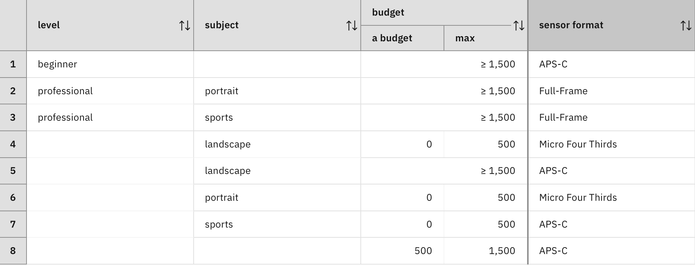
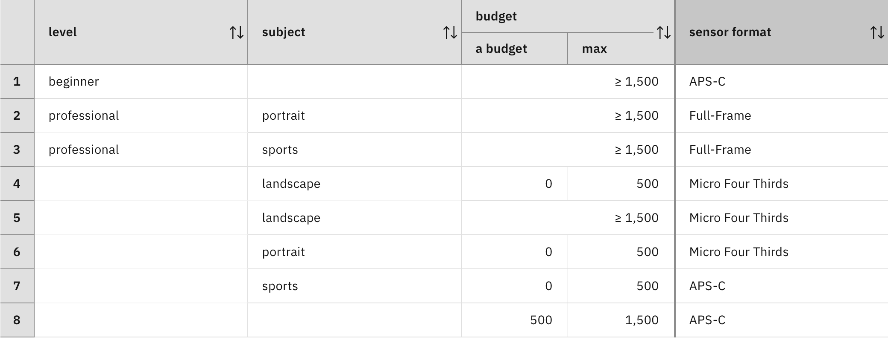

### Selecting or aggregating values from multiple rules

In [Step 1](../step1/description.md), the consistency requirement of a decision logic has been achieved by non-overlapping rule sets. In those rule sets, at most one rule is applicable in each case. From the perspective of two different rules in the rule set, this means that the set of cases in which the first rule is applicable does not overlap with the set of cases in which the second rule is applicable. For this reason, those rule sets are called overlap-free.

Consider the following decision table. It is similar to the decision table with conflicting rows from Step 1. Rows 1 and 5 both determine sensor formats for beginners in landscape photography with high budget. Unlike to the decision table from Step 1, both rows propose an APS-C sensor. Both rows are overlapping, but their decisions do not conflict with each other. As such, any of these rows can be applied or even both.

In general, it is difficult to achieve rule sets that are overlap-free. Overlaps between two rules can be resolved by replacing these two rules by three rules: 

- A rule that is applicable if both of the overlapping rules are applicable. The rule author needs to specify its action.
- A rule that is applicable if the first of the overlapping rules is applicable, but not the second one. This rule has the same action as the first rule.
- A rule that is applicable if the second of the overlapping rules is applicable, but not the first one. This rule has the same action as the second rule.

Resolving all overlaps in this way is a tedious process that will create rules with complex conditions and increase the number of rules. A simpler way is to tolerate overlaps. As a consequence, more than one rule may be applicable to a case. As each rule determines a value for the decision node, there needs to be a way to select one of the candidate values or to aggregate them into a unique result in order to meet the consistency requirement of the decision logic. This can be achieved by defining a conflict-resolution policy (also called interaction policy) for the decision logic.

Moreover, it is completely useless to resolve overlaps if the rules are not conflicting as in the example shown above. In that case, choosing the first value among the candidate values determined by the applicable rules is sufficient. This is achieved by an interaction policy that selects the first candidate value. This policy is called `First rule applies`.

Now consider the decision table with conflicting rows from Step 1. Here, Rows 1 and 5 propose different sensor formats for beginners in landscape photography with high budget, namely APS-C and Micro Fourth Third. The `First rule applies` policy will select the APS-C as the value for the decision node. The order of the candidate values is important here and determined by the order of rules and rows.

According to the `First rule applies` policy, each rule has precedence over the following rules. Whereas this policy is quite common, it does not address all use cases. If the order of rules does not express an order of precedence, then all candidate values for the decision node need to be retained. This can be achieved with an interaction policy called `Collect all values`. This policy requires the decision node to be multi-valued. To set a decision node as multi-valued, check the List box in the details view of the node. A multi-valued node can take a list of values. It should be noted that the same value can occur multiple times in the list.

The `Collect all values` policy will determine the `{ APS-C, Micro Fourth Third }` list for the decision table with conflicting rows. If the decision table with overlapping but non-conflicting rows is used with the `Collect all values` policy, the result will be `{ APS-C, APS-C }` . The number of values retained for the decision node corresponds exactly to the number of applicable rules. Moreover, the same value can occur multiple times.

Changing the cardinality of a node impacts the decision logic of all direct successors of this node. They may need to choose a value among the list or treat them all. In the camera example, this could result into a camera system with multiple bodies. This is quite common among photographers and it may be an interesting exercise to adapt the decision logic to that case. 
 
There are special conflict resolution policies for decision nodes with a numerical type. They work with a single-valued decision node:
- The `Choose smallest value` policy selects the smallest value among the candidate values determined by the applicable rules.
- The `Choose greatest value` policy selects the largest value among the candidate values determined by the applicable rules.
- The `Sum all values` policy computes the sum of all candidate values determined by the applicable rules.

Other selection and aggregation methods such as averaging, argmin, or argmax can be expressed with the `Collect all values` policy and a subsequent decision logic that aggregates the values of the decision nodes in the desired way. The full expressiveness of the rule language can thus be used to construct selection and aggregation methods.

The `Collect all values` and `Sum all values` policies require for rules to use a specific syntax for the action that determines the candidate value for the decision node.Instead of setting the value of the decision variable, they are adding the value to the decision variable. This improves readability for the rule author. The following table classifies interaction policies by decision cardinality and action syntax.

|               | `set decision to ...` | `add ... to decision` |
| ------------- | --------------- | ------- |
| Single valued | First, Min, Max | Sum     |
| Multi valued  |                 | Collect |

#### Exercise: Policy `First rule applies`

Create a diagram with a decision node for sensor format that depends on three input data nodes for level, subject, and budget as in Section [Making intermediate decisions](../../DecisionModeling/step4/description.md). 

Create a decision logic for the sensor format that consists of the decision table “DT with overlapping rows” described above. Ensure that the `First rule applies` policy is selected in the Logic view of the `sensor format` node.

Prepare a test data set in the Run tab where the level is beginner, the subjects is landscape, and the budget is 2000. Run the data set and look at the output. Note the sensor format that is proposed.

Go back to the Logic view and choose `Rules are applied in sequence` in the drop-down menu. Run the data set again. Do you get the same sensor format as for `First rule applies`?

#### Exercise: Policy `Collect all values`

Create a diagram with a decision node for sensor format as above, but make `sensor format` multi-valued by checking the box labeled with “List”.

Create a decision logic for sensor format that consists of the decision table “DT with conflicting rows” described above. Inspect the definition of the action column and check that it has the form `add <a sensor format> to decision` instead of `set decision to <a sensor format>`.

Make sure that the `Collect all values` policy is selected in the Logic view of the `sensor format` node. Create a test data set where the level is beginner, the subject is landscape, and the budget is 2000. Run the data set. How many sensor formats are obtained? How many rows have been applied to `sensor format` in the run history?

#### Lessons learned

The previous steps have introduced three kinds of decision logics. Each of them now has a variant tolerating overlapping rules.

A decision logic based on a _complete and overlapping rule set_ has the following characteristics: 
1. Each rule is able to make a decision alone, based on the information that is available, for all the cases where the rule is applicable.
2. At least one rule is applicable in each case.
3. An interaction policy selects or aggregates decisions made by the applicable rules.

A decision logic based on an _overlapping and incomplete rule set_ has the following characteristics:
1. Each rule is able to make a decision alone, based on the information that is available, for all the cases where the rule is applicable.
2. An undefined decision is obtained if no rule is applicable. 
3. An interaction policy selects or aggregates decisions made by the applicable rules if there is at least one such rule.

A decision logic based on an _overlapping rule set and default value_ has the following characteristics:
1. Each rule is able to make a decision alone, based on the information that is available, for all the cases where the rule is applicable.
2. The default value is used if no rule is applicable.
3. An interaction policy selects or aggregates decisions made by the applicable rules if there is at least one such rule.

Unlike the DMN standard, these different kinds of decision logic are descriptive rather than normative. In ADS, there is no completeness indicator enforcing completeness and no unique policy requiring rules to be overlap-free. Whereas DMN defines hit policies at the decision table level, interaction policies in ADS are defined at the decision logic level and can be applied to multiple rules and decision tables.

#### Limitations

All decision logics considered so far assume that each rule is able to make a decision alone based on the available information for all cases where the rule is applicable. If a decision-making problem is well-structured in terms of intermediate decisions and submodels then it should be possible to meet this assumption. However, if multiple decisions are made by a single decision logic, then this assumption no longer holds. The next step explores and discusses this option. [Continue the tutorial](quiz/quiz.md)

[Back to Decision logic step by step](../README.md)
