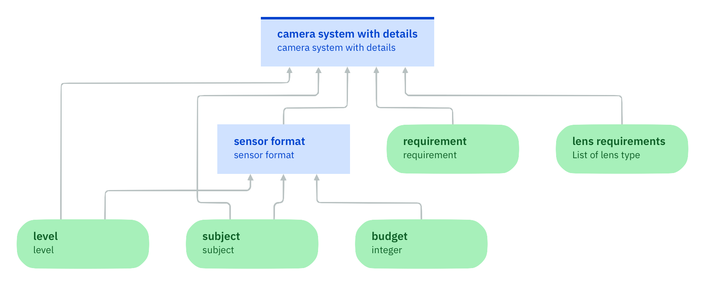

### Making a decision by a sequence of rules

Throughout the previous steps, it was assumed that each rule can make a decision on its own based on the available information, for all cases where the rule is applicable. If a decision is composite, this may require that all components of the decision are represented by predecessors nodes of the decision node. It is then sufficient that the decision logic creates a composite value that assembles these components.

Another option is to create components and composite values with a single decision logic. In such a complex decision logic, multiple rules are needed to determine the composite value of the decision node:
- A first rule creates an instance of the composite type.
- For each component, rules create this component and add it to the composite value.
  
These rules construct the value of the decision node step by step. Each rule receives the value of the decision variable determined by the previous rule and outputs a modified value for the decision variable. The value of the decision node will be the value of the decision variable as determined by the last rule that applied. This behavior is achieved by a particular interaction policy called `Rules are applied in sequence`. This policy introduces a computational state that can be modified by the rules. This state simply consists of the value of the decision variable (and the values of its attributes). The values of other variables cannot be modified.

Policy `Rules are applied in sequence` can be used to configure a camera system with all choices of camera model and lens models made by a single decision logic. This can be achieved by the following dependency diagram:

This diagram no longer uses a submodel for choosing multiple lens models. In Section [Applying a decision model to many values](../../DecisionModeling/step7/description.md), a submodel was invoked for a particular lens requirement. Nodes of the submodel for fixed focus lens and lens model have thus been scoped to this lens requirement. When using a single decision logic to configure the whole camera system, the scope is lost and information about fixed focus lens and lens requirement needs to be associated with the resulting lens model. The easiest way is to replace type “lens model” by a type “lens model with details” that additionally has attributes for fixed focus lens and lens requirement. As a consequence, type “camera system” needs to be replaced by a type “camera system with details” that refers to this new lens model type. For the sake of clarity, its attribute `lens models` will be renamed as `lens models with details`. Furthermore, the decision node `camera system` will be renamed as `camera system with details`.

The decision logic consists of the following sequence of rules:

1. **Init camera system**: A rule for initializing the decision variable with a new camera system with details. No attribute values are specified as the camera and lens models with details have not yet been determined. The value of the decision variable now is a camera system with an undefined camera model and undefined lens models with details.
2. **Choose camera**: A decision table that sets the value of the `camera model` attribute of the camera system to a camera model depending on weight limit, equipped with tilt screen, and sensor format as in Section [One final thing](../../DecisionModeling/step8/description.md).
3. **Create lenses**: A quantified rule that creates a new lens model with details for each lens requirement and adds it to the multi-valued attribute `lens models with details`. The `fixed focus lens` attribute of the new lens model is initialized with false. Attributes for focal length and aperture are initialized with new objects of type `range`. Values for the attributes `minimum` and `maximum` are not specified.
4. **Choose fixed focus lens for portrait and professional**: A quantified rule that sets the value of the `fixed focus lens` attribute for each lens model of the camera system to true if level is professional photographer and subject is portrait.
5. **Choose fixed focus lens for sports and super-telephoto lens**: A quantified rule that sets the value of the `fixed focus lens` attribute for each lens model of the camera system to true if the `lens type` attribute of the lens model is super telephoto lens and subject is sports photography.
6. **Choose lens models**: A quantified decision table that determines name, minimum and maximum focal length, and minimum and maximum aperture of each lens model of the camera system based on the `lens type` attribute of the lens model, sensor format, and the `fixed focus lens` attribute of the lens model. This decision table has five custom action columns that set the values of the five attributes. The table should have the same contents as the corresponding decision table used in Section [One final thing](../../DecisionModeling/step8/description.md)

The `Rules are applied in sequence` policy runs rules in the order in which they are listed. As the first rule has no condition, it is applicable in the initial state and executed in this state. This leads to a new state where the value of the decision variable is an object of type `camera systems with details`. The second rule is a decision table consisting of several rows. Each row is executed in the current state if it is applicable in this very same state and the execution modifies this current state. The third rule is a quantified rule. All instances of the quantified rule are created in the current state. No new instance of this rule is created after the first instance has been executed. The first rule instance is executed in the current state if it is applicable in this state and its execution modifies this state. The second rule instance is executed in the modified state if it is applicable in this state and so on. The applicability of a rule instance is always evaluated in the state in which this instance is executed.

#### Exercise: Policy `Rules are applied in sequence`

Duplicate the data type `lens model` and rename it to `lens model with details`. Add a Boolean attribute called `fixed focus lens` and an attribute called `lens type` of type `lens type`.

Duplicate the data type `camera system` and rename it to `camera system with details`. Rename the attribute `lens model` into `lens model with details` and change its type to `lens model with details`.

Create a decision model with single-valued input data nodes `level` of type `level`, `subject` of type `subject`, `budget` of type `integer`, `requirement` of type `requirement`. Add a multi-valued input data node `lens requirements` of type `lens type`. Add a decision node `sensor format` of type `sensor format` that has `level`, `subject`, and `budget` as predecessors. And a second decision node `camera system with details` of type `camera system with details` that has `sensor format`, `requirement`, and `lens requirements` as predecessors.

Add a decision logic for `sensor format` that consists of the same decision table as introduced in [Making intermediate decisions](../../DecisionModeling/step4/description.md).

Add a decision logic for `camera system with details` that uses the `Rules are applied in sequence` policy and consists of the six rules and decision tables described above. The content of the decision tables for camera and lens models can be reused from section [Applying a decision model to many values](../../DecisionModeling/step7/description.md).

Create a test data set for the decision model where the level is professional, the subject is sports, the budget is 2000, the weight limit is 1000, equipped with tilt screen is false, and the lens requirements include a super-telephoto lens. Run the data set and note the lens model of the resulting camera system.

Change the order of rules such that the rule for choosing lens models precedes the two rules for determining a fixed focus lens. Run the data set again. Is the same lens model obtained? If not, why did it change?

#### Lessons learned

A decision logic based on a _rule set with the `Rules are applied in sequence` policy_ has the following characteristics:
1. Rules are applied in sequence and may modify the values of the decision variable or its components, but nothing else.
2. An undefined decision is obtained if no rule is applicable. 
3. Τhe value of the decision node is the value of the decision variable obtained after applying the last rule.

#### Limitations 

Determining a composite value together with its components in a single decision logic has several drawbacks:
1. Rules requiring a result from some other rule must succeed this other rule. For example, the decision table for determining lens models requires information about fixed-focus lens and needs to succeed rules that determine this information.
2. Dependencies between intermediate computations made by the decision logic are not shown.
3. Composite values such as lens models need to be extended with additional details needed for intermediate computations (such as fixed focus lens and lens requirement). Composite values thus mix results with input data and intermediate computations.

<!--This story shows that submodels that applied within a scope permit to express a dependency structure between decisions that cannot be shown outside this scope-->

<!--Outside this scope, the whole structure collapses and one ends up with a single sequential policy that mixes rules for different decisions. Nevertheless the ordering of rules needs to respect an implicit dependency structure since otherwise nothing works.-->

The next step will address these limitations. [Continue the tutorial](quiz/quiz.md)

[Back to Decision logic step by step](../README.md)

