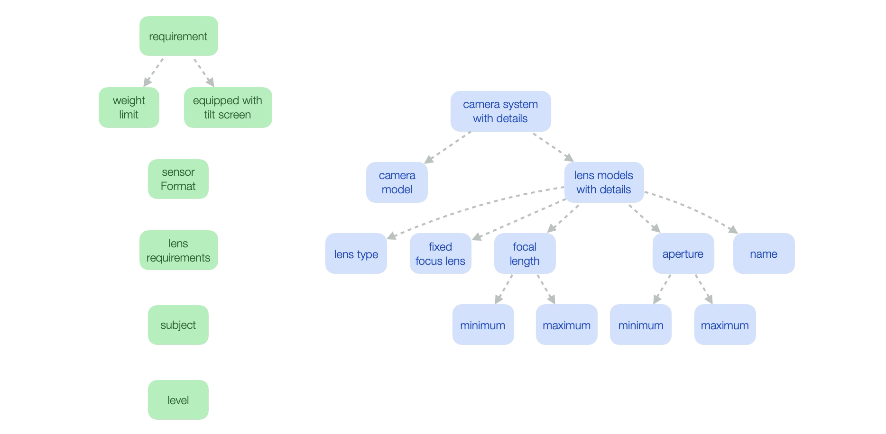
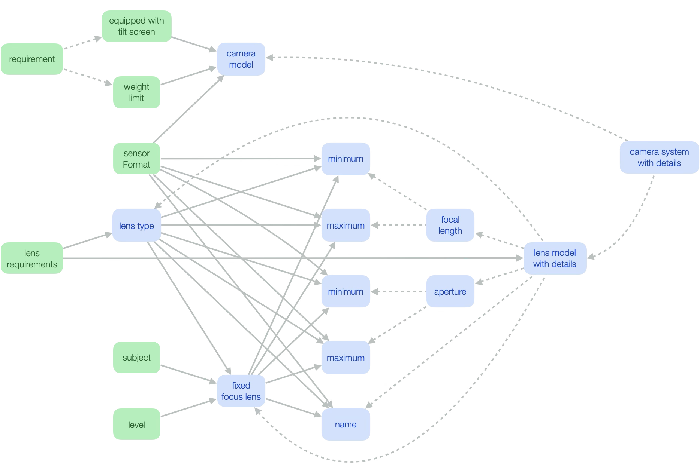
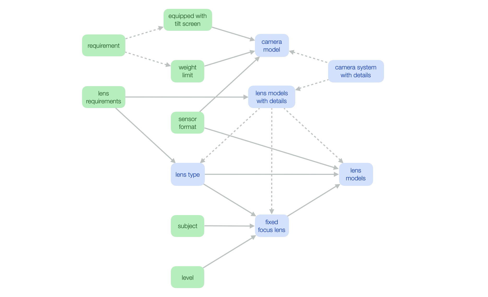
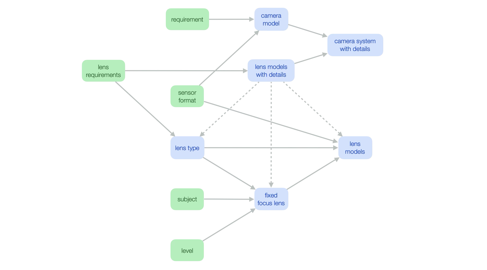
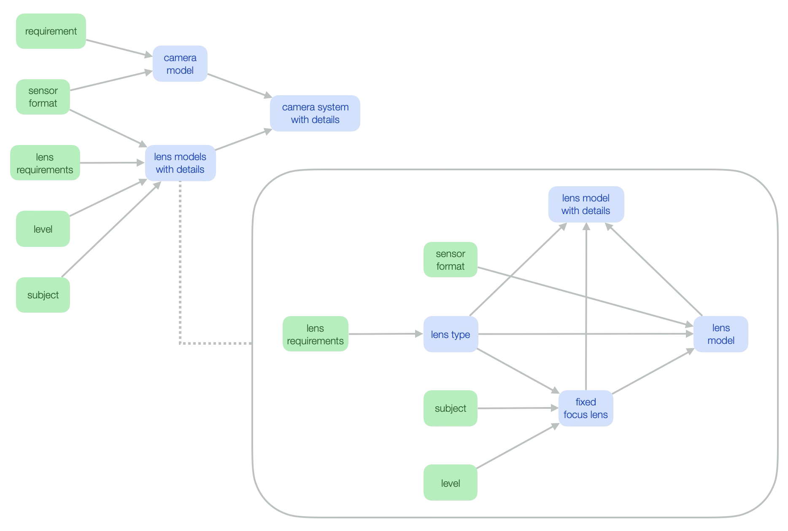

### Transforming a sequential decision logic into a submodel

A complex decision logic as described in the [last section](../step5/description.md) involves a sequence of rule applications. This provides a convenient way for describing the construction of a composite value step by step. First the main object is created and then the values of its attributes are determined one after the other. The author of the decision logic has to keep in mind which attribute values are needed when determining the value of some other attribute. For example, the `fixed focus lens` attribute is needed for determining name, focal length, and aperture of lens models. Therefore, rules for setting the values of attribute `fixed focus lens` need to precede rules for setting these other attribute values.

Whereas the original author of the decision logic may have these dependencies between attributes in mind, they are documented nowhere and another ADS user may change the order of rules for some reason and inadvertently break the unwritten dependencies. Moreover, this other user may have a difficult time to understand which rule modifies which attributes as all kinds of rules are mixed together in a single rule set.

The great advantage of rule-based systems is to break a complex behavior into simple pieces, namely the rules. This works well if the rules are independent of each other within the given setting, but not if there are implicit dependencies between rules. In presence of hidden dependencies, the maintenance of a larger rule set may become an impossible tasks. Many early rule-based systems failed and were abandoned due to maintenance problems. The example from the last section has shown that such maintenance problems can already arise for small rule sets if the `Rules are applied in sequence` policy is used. For rule sets with hundreds or thousands of rules, the risk of introducing errors by a bad rule ordering appears to be very high. Maintaining such a rule set will be a very tedious task.

Could a complex decision logic be transformed into a form that reveals the dependencies between attributes and avoids an incorrect ordering of the rules? If rules are organized by attributes, then those dependencies will impose important constraints on the rule ordering: if an attribute depends on some other attribute then its rules need to succeed the rules of this other attribute in the rule ordering. Does ADS provide a means to organize rules in this way?

There will be a surprising answer to this question. It will be revealed after two steps. The first step consists in identifying dependencies between attributes. The second step proposes a transformation of the decision logic such that these dependencies are clearly declared in ADS.

#### Analyze dependencies between attributes 

The first step consists in analyzing the rules in order to find dependencies between attributes. When speaking about attributes, some precision is needed. For example, consider a camera system that has a main camera and a secondary camera. Suppose that both cameras are composite values and have an attribute `sensor format`. There may be a rule that determines the sensor format of the secondary camera depending on that of the main camera (e.g. the rule may choose a different format for the second camera). In that case, attribute `sensor format` of the secondary camera depends on attribute `sensor format` of the main camera. It is important to distinguish these two attributes in this analysis since rules for choosing the sensor format of the main camera need to precede those for choosing the sensor format of the secondary camera. 

The analysis will therefore determine dependencies between attribute expressions. Examples for attribute expressions are:
- an attribute of a predecessor node: `the weight limit of requirement.`
- an attribute of the decision node: `the camera model of decision`.
- an attribute of a local variable of a quantified rule: `the maximum of the aperture of this lens model`.  

Those attribute expressions can be drawn in a graphical form. The following diagram depicts the decision node, its predecessor nodes, and all attribute expressions. Predecessor node `requirement` has two attributes `weight limit` and `equipped with tilt screen`. Both are represented by nodes labelled with attributes names and there are two dashed arcs going from node `requirement` to the node of its attributes. These ownership links between two nodes express that the second node represents an attribute of the first one. They simplify the diagram as it is sufficient to label attribute nodes with the attribute name instead of the full attribute expression. The decision node `camera system with details` has two attributes, namely `camera model` and `lens models with details`. Again, there are dashed ownership links between the decision node and its attributes. A lens model with details has multiple attributes, among which aperture and focal length have again attributes. This results into an ownership tree consisting of multiple levels as shown in the diagram.

The next step consists in analyzing each of the rules of the complex decision logic introduced in the [last section](../step5/description.md). If a rule reads the value of an attribute and modifies the value of another attribute then this other attribute depends on the first one. These dependencies will be represented by solid arcs in the diagram.
1. The first rule initializes the decision variable, but does not access the value of any attribute or variable. The diagram shows no dependency link for this step.
2. The second rule reads the values of attributes `weight limit` and `equipped with tilt screen` and the value of predecessor node `sensor format`. The rule modifies the value of attribute `camera model`. The diagram shows three ingoing dependency links for this attribute.
3. The third rule reads the values of predecessor node `lens requirements` and adds a new value to attribute `lens models with details` for each of them. This is depicted by a dependency leading from `lens requirements `to `lens models with details`. Furthermore, the rule initializes attribute `lens type` with a value from `lens requirements`. This is depicted by a dependency leading from `lens type` to `lens requirements`.
4. The fourth rule reads the values of predecessor nodes `subject` and `level` and modifies the value of attribute `fixed focus lens`. This is depicted by two dependency links.
5. The fifth rule reads the value of attribute `lens type` and the value of predecessor node `subject`. This is depicted by two dependency links. The one between `subject` and `fixed focus lens` has already been mentioned.
6. The sixth rule reads the values of attributes `lens type` and `fixed focus lens` and the value of predecessor node `sensor format`. It modifies the values of various attributes of `lens models with details`, namely name, minimum and maximum aperture, and minimum and maximum focal length. This leads to 3\*5 dependency links in the diagram.

The diagram showing all the fine-grained dependencies between attributes is not very readable and asks for simplification. This will be done in the next steps.

> Note: if the values of the decision variable or of one of its attributes is modified by multiple rules, then it will be necessary to introduce multiple copies of these attribute expressions in the attribute-dependency diagram in order to distinguish values obtained after different rules.

#### Transform model and declare dependencies

The second step consists in transforming the diagram such that it can be represented in ADS. It involves several simplifications and transformations.

The attribute-dependency diagram can be simplified by regrouping nodes that have the same ingoing dependencies and by introducing a composite type for the grouped node. This follows the idea that has been explained in Section [Composite types](../../DecisionModeling/step5/description.md). Attributes for minimum and maximum aperture, minimum and maximum focal length, and name of `lens models with details` have all the same ingoing dependencies as their values are modified by the same rule. Therefore, it is possible to replace these five nodes by a single node and choose a suitable type for it. This may require the definition of a new data type. In this particular example, a data type for these five attributes has already been introduced, namely the type `lens model` (without details). The simplified diagram indicates the regrouped node as `lens model`. This node receives dependencies from `lens type`, `fixed focus lens`, and `sensor format`. Moreover, it receives an ownership link from `lens models with details`. Hence, all ingoing links of any of the five regrouped attributes are redirected to the grouped node.

> Note: regrouping nodes may require a syntactic reformulation of the rules as the structure of objects is modified.

An attribute-dependency diagram resembles a dependency diagram, but has ownership links in addition. For example, node `requirement` has ownership links leading to its attributes `weight limit` and `equipped with tilt screen`. As the values of these attributes can be accessed via node `requirement`, it is possible to remove the attributes from the diagram and to delegate their outgoing dependencies to their parent. This transformation is quite simple as these attributes do not have any ingoing dependencies. In this way, it is possible to eliminate attributes of predecessors nodes.

This technique cannot be applied to attributes of decision nodes since these attributes have ingoing dependencies. These dependencies would be lost if attributes were simply removed. Another technique for eliminating ownership links consists in transforming attributes into decision nodes. For example, attributes `camera model` and `lens models with details` of decision node `camera system with details` can be transformed into decision nodes by removing the ownership links. This requires a reformulation of the rule sets. Rules that modify the value of `camera model` will be moved to the decision logic for `camera model`. Similarly, rules that add values to `lens models with details` or that modify values of its attributes will all be moved to the decision logic for `lens models with details`. After reformulation, the rules will directly modify the values of those nodes instead of modifying the values of attributes of `camera system with details`.

By removing the outgoing ownership links of decision node `camera system with details` , this node no longer is connected to other nodes of the diagram. However, its value depends on that of `camera model` and `lens models with details`. For this reason, ingoing dependency links have to be added. If a node is single-valued, its outgoing ownership links can be transformed into reverse dependency links. This transformation is shown in the following diagram. It requires a modification of the rules. The rule for initializing decision node `camera system with details` now has to initialize its attributes with the values of its new predecessor nodes.

As attribute `lens models with details` is multi-valued, it is not possible to transform its outgoing ownership links into ingoing dependency links as just described. Each of the predecessor nodes would have multiple values and it is not clear which ones belong together and can be used to create a lens models with details. Multi-valued nodes require another technique, which consists in introducing a submodel with single-valued nodes. The rule that creates values of the multi-valued node will be reformulated such that it creates these values by calling the submodel.

In the main model, the attributes `lens type`, `fixed focus lens`, and `lens model` of decision node `lens models with details` are removed and their ingoing dependencies from other nodes are delegated to `lens models with details`. If these three attributes had outgoing dependencies to any other node, they would be delegated to `lens models with details` as well. 

The submodel has a single-valued decision node `lens model with details`. It has ownership links to its attributes `lens type`, `fixed focus lens`, and `lens model`. As these three attributes have been removed in the main model, the submodel needs to include their ingoing dependencies from the original diagram. This includes the dependencies between `lens type` and `lens model` and between `fixed focus lens` and `lens model`. But it also includes the dependencies between `sensor format` and `lens model`, between `lens requirement` and `lens model`, between `subject` and `fixed focus lens`, and between `level` and `fixed focus lens`. For this reason, the nodes `sensor format`, `lens requirement`, `subject`, and `level` need to be included in the submodel as well.

As decision node `lens models with details` of the submodel is single-valued, its outgoing ownership links can be transformed into reverse dependencies as explained before. The attributes of this decision node are thus transformed into decision nodes and its rules need to be reorganized correspondingly. Decision node `lens model with details` will have a single rule for creating its value, which may have the following form:

	set decision to a new lens model with details where
	    the name is the name of 'lens model',
	    the aperture is the aperture of 'lens model',
	    the focal length is the focal length of 'lens model',
	    the lens type is 'lens type',
	    the fixed focus lens is 'fixed focus lens' ;

The resulting diagram no longer contains ownership links. It has the form of an ADS decision model with a submodel. All attributes have been converted into decision nodes and rules have been re-organized according to these decision nodes. Dependencies between attributes appear as dependencies between the corresponding decision nodes. This new diagram clearly depicts all intermediate decisions made by the complex rule set and documents their dependencies. This solves the maintenance problem by leveraging the existing ADS modeling capabilities.

#### Exercise: replace decision logic by submodels

Introduce two submodels that correspond to the dependency diagrams outlined above:

- A submodel for `camera-system with details`.
- A submodel for `lens model with details`.

Modify the decision model developed in the [last section](../step5/description.md) as follows: 

- Move the rules of decision node `camera-system with details` to the submodels and adapt them (e.g. by replacing attributes with variables where necessary). Replace setter-calls for attributes by constructor calls that initialize attribute values.
- Replace the decision logic for `camera-system with details` by a single rule that sets the value of the decision node to the result of calling the submodel for `camera-system with details`.

#### Exercise: interaction policy

This exercise will ensure that the `Rules are applied in sequence` policy is no longer used and sources for possible maintenance problems have been removed.

Review each decision logic of the three decision models and use the `First rule applies` policy for single-valued decisions and the `Collect all values` policy for multi-valued decisions. Does this lead to errors? If yes, review the form of the rules:

> No rule of the three decision model should read the value of the decision variable or one of its attributes.

#### Exercise: comparison of decision models

Compare the three decision models introduced above with the two decision models from Section [One final thing](../../DecisionModeling/step8/description.md). Which decision models correspond to each other? Are there big differences in the decision logics?

#### Lessons learned

<!--If multiple rules of a complex decision logic  are needed to make a single decision, then different rules will make different contributions to this decisions such as setting values of different attributes. These contributions correspond to sub-decisions. Introducing a submodel allows us to explicitly declare those sub decisions and their dependencies -->

This step undid the last step and reproduced decision logics as used in Section [One final thing](../../DecisionModeling/step8/description.md) albeit the decision models are structured a bit differently. Neither the models developed in this step, nor that developed in Section [One final thing](../../DecisionModeling/step8/description.md) suffer from the maintenance problems of a complex decision logic and the `Rules are applied in sequence` policy as developed in Step [Making a decision by a sequence of rules](../step5/description.md): all decisions and their dependencies are clearly declared in the diagram!

So why has this discussion of complex decision logics been included here? What has been learned by the last step that introduced this complex decision logic and what has been learned by the present step that replaced them by submodels, thus undoing all the work of the last step?

Firstly, you should now better appreciate the advantages of a well-crafted decision model as the one developed in Section [One final thing](../../DecisionModeling/step8/description.md). In order to understand an achievement, it is sometimes necessary to explore alternatives and to understand the drawbacks of these alternatives.

Secondly, developers of decision models might not start with well-crafted models as in Section [One final thing](../../DecisionModeling/step8/description.md), but with complex decision logics as in Step [Making a decision by a sequence of rules](../step5/description.md). The discussion in this section shows that those complex decision logics may be transformed into well-structured submodels. It also outlines a methodology for doing this transformation, which consists in analyzing dependencies between attributes and in transforming attributes into decisions.

However, this transformation is tedious and requires discipline. It is far better to start right with well-crafted decision models. This will avoid maintenance problems caused by complex rule sets that mix different decisions. Furthermore, well-crafted models are easier to understand and are deemed intuitive as decisions and their dependencies are clearly indicated. Time invested in defining well-crafted decision models will always pay off in the long-term! 

[Back to Decision logic step by step](../README.md)
