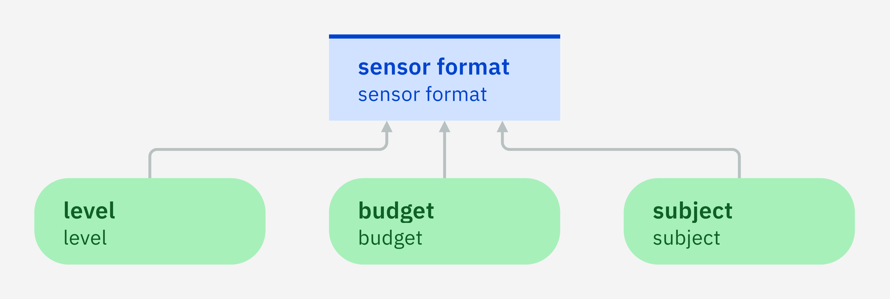
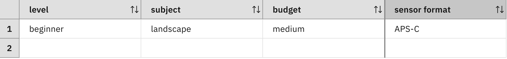

### Making decisions for a population of cases

Even if the customer ranks sensor formats in a certain
way, it does not mean that the customer buys a full-frame camera
although it is the best choice in the ranking. Indeed, the best choice might
not be feasible in all cases. For example, a full-frame camera might turn
out to be too heavy for the customer when they do landscape
photography. It can also be out of budget. The customer
needs to determine which alternatives are feasible and then choose
the best camera among this reduced set of alternatives.

A particular customer needs to do this feasibility consideration only
once. However, consider a whole population of customers. Assume that they all rank the three sensor formats in the same way as
before. However, they have different characteristics and end up with different 
sets of feasible sensor formats. Customers might have a low, a medium, or a high
budget. Some of them might want to do landscape photography,
others might want to do portraits, night photography
and so on. Furthermore, there might be beginners, advanced photographers, 
and professionals. All these factors determine the feasibility of the
alternatives.

The available alternatives thus depend on the specific
case. In certain cases, the best alternative is no longer possible
and the second best or third best choice needs to be made. The problem
now consists in suggesting the best feasible sensor format that depends
on the specific case. An analyst can list all the possible cases,
determine the feasible alternatives for each of these cases, and
retain the best choice for each case. 

#### Exercise 1

Create a spreadsheet with columns for characteristics such as

 - Budget: low, medium, high.
 - Subject: landscape, portrait, sports.
 - Level: beginner, professional.
 
Add rows for all the 18 combinations. Each row thus describes a
possible case.
 
Add a column for each sensor format that indicates whether this sensor format is feasible for the specific case. 
The following constraints are used here for the sake of the exercise:

 - Low budget eliminates APS-C and full-frame cameras.
 - Medium budget eliminates full-frame cameras.
 - Sports photography eliminates Micro Four Thirds cameras.
 - Landscape photography eliminates full-frame cameras.
 - Beginner level eliminates full-frame cameras.

Add a column that shows the best decision for each
case. Use the ranking from [Step 1](../step1/description.md)
to determine which is the best decision among the sensor formats that are feasible.
If all sensor formats are infeasible for a case, indicate that no
recommendation is made for that case.

For example, the following row describes a beginner who has a medium
budget and is interested in landscape photography. An APS-C camera
and a Micro Four Thirds camera are feasible alternatives in this case,
but a full-frame camera is not. This feasibility eliminates the best choice in the
initial ranking, meaning that the decision will be the second choice,
namely an APS-C camera.

| Level    | Subject   | Budget | Full-Frame | APS-C    | Micro-Four Thirds | Decision |
| -------- | --------- | ------ | ---------- | -------- | ------------------ | -------- |
| beginner | landscape | medium | infeasible | feasible | feasible           | APS-C    |
| ...      | ...       | ...    | ...        | ...      | ...                | ...      |

#### Exercise 2

Define an Automation Decision Services decision table that directly maps each case to a decision:

 - Create a data model with enumeration types for budget, subject,
   level, and sensor format.
 - Create a decision model with three input data nodes for budget,
   subject, and level, and a decision node for sensor format.
 - Ensure that the decision node depends on the three input data nodes as indicated by the diagram.
 

 - Add a decision table to the decision node that has columns for all input data nodes.
 - Complete the rows according to the spreadsheet. 
 
For example, the following row describes a beginner who has a medium
budget and is interested in landscape photography. An APS-C camera is
suggested in this case:
 

 

#### Lessons learned

Unlike the spreadsheet, the decision table does not have columns
that show the feasible sensor formats. This information is
needed to find out which are the best decisions for the specific
cases. However, it is not necessary to define a
decision service that outputs the best decision of a case when
this case is given as input. 

The ranking that is determined in Step 1 does not appear in the decision table either.
However, you are able to identify the best decision for each case and thus
verify that the decision logic is consistent with this ranking.

Do not confuse decision tables with consequence tables that are used to 
evaluate the alternatives according to different criteria (see [Step 1](../step1/description.md)).
As illustrated, a decision table provides a shortcut for determining the
best feasible alternative for a specific case. It thus refers to information that constrains 
the set of alternatives, whereas a consequence table refers to the consequences of 
the alternatives. 

#### Limitations

This approach is suited if the number of cases is relatively
small. Filling out a row for each case is laborious. The [next step](quiz/quiz.md)
examines how it can be improved.

[Back to ADS concepts step by step](../README.md)

