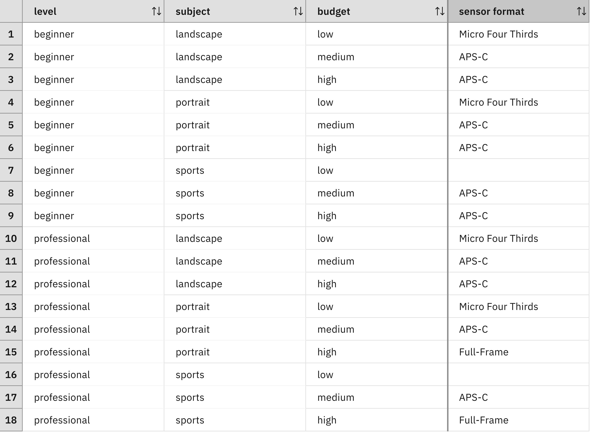
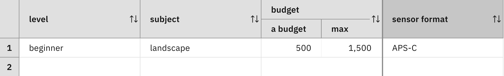

### Making decisions for families of cases

In practice, it will not be possible to enumerate all possible
cases. Even in the example of [Step 2](../step2/description.md),
it has been laborious to list all the cases and to figure out a decision for
them. 

Now assume that the budget is not modeled in a qualitative way by
three levels low, medium, and high as in the decision table above, but
in a quantitative way. If a low budget ranges from 0 to 499 this means
that all rows concerning a low budget need to be duplicated 500
times. Similarly, if a medium budget ranges from 500 to 1499 all rows
concerning a medium budget need to be duplicated 1000 times. And
finally, all rows concerning a high budget need to be duplicated an
infinite number of times as a high budget will cover all integers
starting from 1500. In other words, this change will blow up the
number of cases in a way that prevents us from enumerating all the
cases.

Fortunately, often the same decision will be made for similar
cases. It is then possible to regroup those cases into families of
cases. To find such a family, an analyst needs to identify the
decision boundaries between different families of cases. An analyst
may ask questions such as:

> Which is the budget that a beginner in portrait photography would
> need in order to buy an APS-C camera instead of a Micro-Four Third
> camera?

Analysts should be able to find out those thresholds. Once they have
identified them, they can describe the families of similar cases by
using intervals. For example, we may consider all cases where a
beginner wants to do landscape photography and has a budget between 500
and 1500. This family can be described in terms of a logical condition:

    'level' is beginner
    and 'subject' is landscape
    and 'budget' is at least 500 and less than 1500

The fact that an APS-C camera is chosen can be formulated by a
statement that assigns the value APS-C to a decision variable
representing the choice of the sensor format:

    set decision to APS-C ;

And the fact that this decision is made for all cases in the
considered family can be written as an if-then-rule:

    if
        'level' is beginner
        and 'subject' is landscape
        and 'budget' is at least 500 and less than 1500
    then
        set decision to APS-C ;

Each row in a decision table corresponds to such an
if-then-rule as a decision table is just a tabular
representation of multiple rules of same form. Rules permit richer
forms of conditions and may permit shorter textual representations of
families of cases. It is even possible to use both decision tables
and rules. This means that some cases will be decided by decision
tables, whereas other cases will be decided by a rule.  The
decision logic of a decision consists of all rules and decision tables
that are making this decision for some case.

#### Exercise 1

Use a quantitative budget: 

 - Modify the type of the `budget` node to `integer`. 
 - Redefine the definition of the budget column in the decision
   table. Replace `budget is <a budget>` by `budget is at least <min>
   and less than <max>`.
 - Replace the qualitative budget values by intervals (e.g. low by
   `[0, 500)`, medium by `[500, 1500)`, high by `>= 1500`).

For example, the following row describes a beginner who has a budget
in `[500, 1500)` and is interested in landscape photography:

#### Exercise 2

Try to reduce the number of rows by merging rows that have the same
decision, the same level and photographic subject, and joint
intervals. Some examples:

 - Whenever the budget is in `[500, 1500)`, an APS-C camera is
   recommended. So all rows concerning such a budget can be merged
   into a single row.
 - Whenever the budget is at least 1500 and the level is beginner, an
   APS-C camera is recommended. Again all these rows can be merged
   into a single one.
 - Whenever the subject is landscape and the budget is in `[0, 500)`,
   a Micro-Four Third camera is recommended. Again these cases can be
   merged.
 - Whenever the subject is portrait and the budget is in `[0, 500)`,
   a Micro-Four Third camera is recommended. Again these cases can be
   merged.
   
Can you transform the decision table into an equivalent one
that has less than 10 rows?

#### Lessons learned

The same row may participate into several of these merging steps. As a
consequence, the transformed decision table may have rows that
overlap. This means that there are cases that are matched by multiple
rows. This is not an issue as long as these rows are resulting into the
same decision.

#### Limitations

The decision table developed in the last exercise provides a convenient
way to recommend a sensor format to different kinds of
customers. However, the true problem of the customer is to choose a
camera from a catalog. There are many camera models available and new factors
need to be considered in order to make a recommendation. Each camera
has a multitude of technical characteristics and features. Each of
them could be considered by the customer in order to make a
choice. For example, the customer may require that the color of the
camera is silver, that it has a tilt screen and a viewfinder, and put
a limit on its weight. All these requirements impact which camera models are
feasible and thus influence which decision will be made in the
end.

A decision table for choosing a camera will have additional condition
columns and a modified action column. Each new condition column may
duplicate the existing rows for each possible value of this column.
This means that the number of rows may grow exponentially with the
number of columns. The [next step](quiz/quiz.md) will examine a method to address this issue.

[Back to ADS concepts step by step](../README.md)
