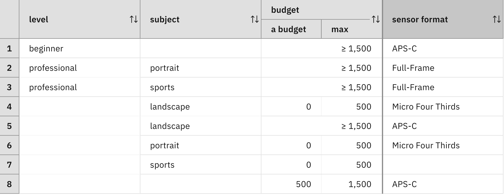
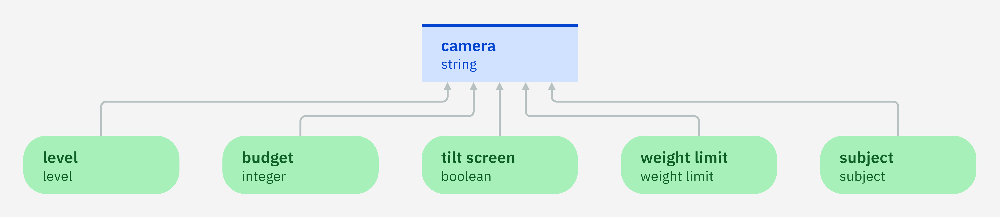
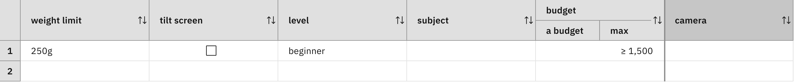
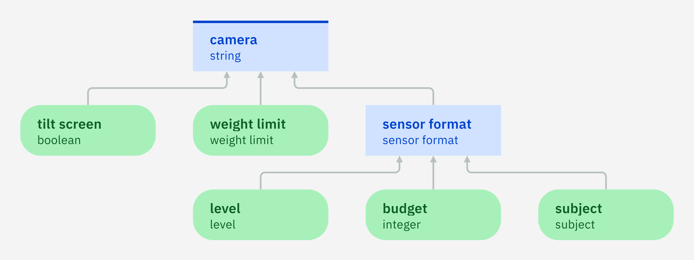
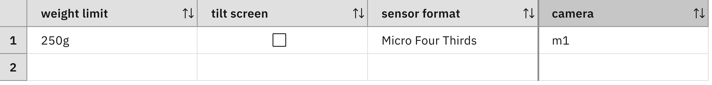

### Making intermediate decisions

There are many factors that may influence the choice of a camera. In
addition to budget, subject, and user level, we may consider the color,
the presence of a tilt screen and viewfinder, and a limit on the
camera weight. Each additional factor will multiply the number of
possible cases and thus lead to additional rows in a decision table
that maps the possible cases to camera models.

This example illustrates that the number of rows of decision tables
may grow exponentially with the number of condition columns. One way
to remedy this issue consists in breaking the whole decision logic
into smaller pieces. This can be achieved by identifying intermediate
decisions. These intermediate decisions will depend on some of the
input data nodes, but not all of them. The final decision (i.e. the
decision that we have to make in the end) will depend on the
intermediate decisions. As the final decision now depends on the
intermediate decisions, it may no longer depend on all of the input
data nodes. The whole purpose of this transformation is to reduce the
number of dependencies of the final decision while keeping the number
of dependencies of intermediate decision small as well. A smaller
number of dependencies will reduce the number of cases that need to be
covered by the decision logic of the final decision. This
simplification is possible as each intermediate decision will have its
own decision logic. As an intermediate decision should not depend on
all of the input data nodes, its decision logic needs to cover less
cases than the original decision logic. In the end, a huge decision
table will thus be decomposed into several smaller decision tables.

To simplify the logic for recommending a camera, we may, for example,
introduce an auxiliary decision for choosing the sensor format. We
introduce a new decision node for this purpose. This decision depends
on the user level, the subject, and the budget (and has the same
decision logic as specified in [Step 3](../step3/description.md)). 

The decision about a camera model will then depend on the sensor
format, but no longer on the user level, the subject, and the
budget. Hence, the number of dependencies of the camera model will be
reduced by two and the number of columns of its decision table will be
reduced by two as well. It should be noted that the intermediate
decision will depend on some of the input data nodes, but not all of
them.

#### Exercise 1

Create a decision model for recommending a camera model:

 - Add an enumeration type for the weight limit with the three values 250g, 500g, 1000g.
 - Add input data nodes for budget, subject, level, weight limit, and tilt screen (yes/no).
 - Add a decision node for the camera model with type string. Camera
   models will be anonymously named by `m1`, `m2`, `m3`, and so on.
 - Ensure that the decision node depends on the five input data nodes as indicated by the diagram:
 

Add a decision table recommending the best camera model for each
possible case. 

- Ensure that the columns are in the same order as the ones from the decision table introduced in Step 3 (see
  above). The column's order can be updated in the creation wizard using drag and drop.
- Copy the contents of the rows from the decision table introduced in Step 3 into the adequate columns.
- Duplicate the rows for the different weight limits as well as the tilt
  screen option. This requires six copies of the eight rows.
  
For the sake of simplicity, the decision column will not be filled out
in this first exercise.

For example, the following row shows all cases where the weight limit
is 250g, no tilt screen is desired, user lever is beginner, and the
budget is 1500 or more:

#### Exercise 2

Refactor the decision model by introducing an intermediate decision for the sensor format:

 - Ensure that the sensor format depends on budget, subject, and level.
 - Ensure that the camera model depends on the sensor format.
 - Remove the dependency links between budget, subject, level and the camera model.
 - Add a decision table in the logic of the sensor format node and copy the contents of the rows from the decision table introduced in Step 3.

Add a decision table recommending the best camera model for each
possible case and add a camera model to the decision column. For some
requirements, no camera model exists and no recommendation should be
made. The corresponding rows can be left out:
  
- There are no full-frame cameras lighter than 250g. No
  camera model should be recommended in that case.
  
- If the weight limits is 1000g, only full-frame cameras will be
  recommended.  No camera model should be recommended for other cases
  with weight limit 1000g.
  
For example, the following row shows a recommended camera for a weight
limit of 250g, no tilt screen, and a Micro-Fourth Third format:

#### Lessons learned

The number of rows of a decision table may grow exponentially with
respect to its number of condition columns. In many decision-making
problems, it is possible to decompose a large decision table into
smaller decision tables with the help of intermediate decisions. It
should, however, be noted that this decomposition will only be
effective if the intermediate decisions are breaking two or more
dependencies between input data nodes and the final decision.

In the example, we assumed that the camera model only depends on the
sensor format and not on the subject, level, or budget. If different
APS-C camera model were recommended for beginners and
professionals then this assumption would not hold. Finding out the
right dependencies thus requires a careful analysis of the
decision-making problem.

#### Limitations

Whereas the dependency diagram of the example has only six nodes,
more complex problems may have numerous input data nodes and decision
nodes. If a diagram has more than twenty nodes, it will not be that
easy to read and understand. The [next
step](quiz/quiz.md)
will present an easy method to reduce a diagram in size.

[Back to ADS concepts step by step](../README.md)
