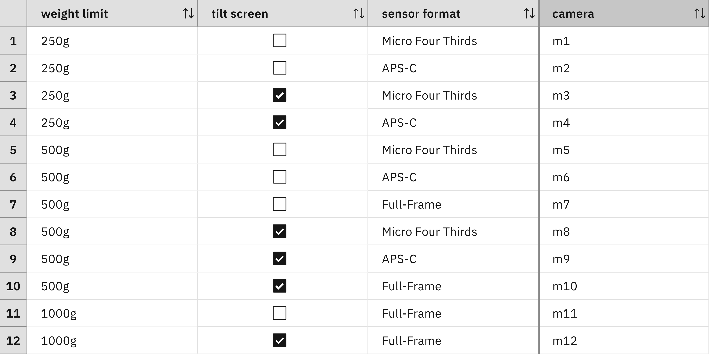
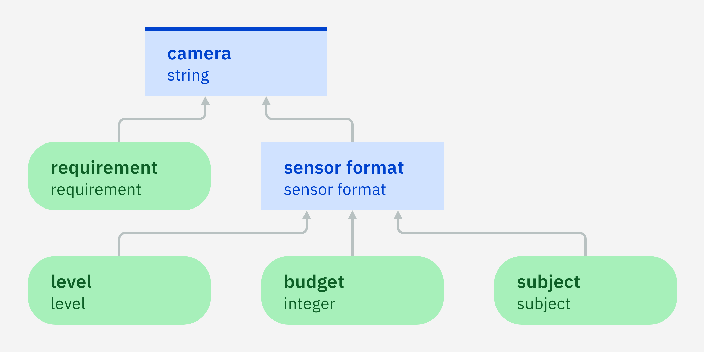

### Composite types

A dependency diagram may have many nodes. If there are too many, the diagram is
difficult to read. Nodes that have the same direct predecessors and
successors may be regrouped into a single node in order to reduce the
diagram in size.

The diagram for camera recommendation has several nodes listing
different characteristics of the desired camera and there may be many
more such as different kind of connections (microphone input,
headphone output, USB, ...), the speed of the card slots, and so
on. These nodes all have the same connectivity with respect to other
nodes in the diagram:

1. They have no ingoing dependency link as they are input data nodes.
2. They have a single outgoing dependency link to the node for the
   camera decision.

As these nodes have the same direct predecessors and the same direct
successors in the dependency graph, we could replace them by a single
node without changing the dependency relation.

For example, we might replace the input data nodes for the weight
limit and the tilt-screen option by a single node called
`requirement`. But which will be the value of this new node? It is a
composite value consisting of two components, namely

 - a weight limit which may be one of the values `250g`, `500g`,
   `1000g`.
 - a Boolean value indicating whether a tilt screen is desired or not.
 
In order to use such a composite value in ADS, a composite type needs
to be defined. A composite type may have one or more attributes, which
are used to describe the components of the composite value. Each
attribute has a type. For example, we may introduce a composite type
`requirement` that has the following two attributes:

 - `weight limit` of type `weight limit`.
 - `equipped with tilt screen` of type `Boolean`.

The node `requirement` has a value of type `requirement`
and thus replaces the two nodes `weight limit` and `tilt screen`
without any loss of information. The new diagram is more compact and
easier to read. Furthermore, it is also more robust with respect to
changes. If new requirements about the camera are added, it will not
be necessary to add new input data nodes for these
requirements. Instead of this, it will be sufficient to add attributes
to the type `requirement`.

Interestingly, the regrouping of the two nodes `weight limit` and
`tilt screen` does not require any substantial change of the decision
table of the camera model. The content of the table can be
preserved:

However, the weight limit and the tilt-screen option are no longer
values of input data nodes, but attributes of a value of an input data
node. As such, they are not accessed in the same way as before in the
decision table. The previous decision table accesses the values via
the following expressions (which are defined in the headers of the
respective condition columns):

    'weight limit' is <a weight limit> 
    'tilt screen' is <a boolean>
    
The new decision table accesses the attribute values in the following
way by using an expression of the form `<attribute> of <variable>`: 
  
    the weight limit of 'requirement' is <a weight limit> 
    'requirement' is equipped with tilt screen is <a boolean>

This kind of expression can also be used in rules. For example, the
following rule recommends a camera model `m1` if the attribute `weight
limit` of the value of node `requirement` has the value `250g`, the
attribute `equipped with tilt screen` of the value of node
`requirement` has the value `true`, and the value of node `sensor
format` is `Micro Four Thirds`:

    if
        the weight limit of 'requirement' is 250g
        and 'requirement' is equipped with tilt screen
        and 'sensor format' is Micro Four Thirds
    then
        set decision to "m1" ;

#### Exercise

Refactor the decision model by regrouping the input data nodes `weight
limit` and `tilt screen`:

 - Define a composite type `requirement` with two attributes
   `weight limit` and `equipped with tilt-screen`.
 - Add an input data node `requirement` of type  `requirement`.
 - Delete the input data nodes `weight limit` and `tilt screen`.
 - Ensure that the camera decision depends on the requirement as in indicated by the diagram:
 

Adapt the decision table of the camera decision node:

 - Change the definition of the weight-limit column into `the weight limit of 'requirement' is <a weight limit>`.
 - Change the definition of the tilt-screen column into `'requirement' is equipped with tilt screen is <a boolean>`.
 
#### Lessons learned
 
It is possible to express quite sophisticated decision models in ADS
with primitive types alone. So far, the main reason for using
composite types is to regroup nodes with the same predecessors and
successors. Hence, those composite types are not defined before
creating the diagram, but during this process!

We have seen an example for regrouping input data nodes, but it may
also be useful to regroup several decision nodes. However, this will
only be effective if the decision logics of these decision nodes are
similar, i.e. consider the same families of cases. If not, it will be
necessary to split those families into smaller sub-families, thus
increasing their total number. This will make the decision logic more
complex than necessary.

#### Limitations

In the example above, we regrouped multiple values such as the weight
limit and the tilt-screen option into a composite value. This
composite value has two components, each of which is described by an
attribute of the composite type. A composite type has a fixed number
of attributes, meaning that the number of components of a
corresponding composite value will be fixed as well.

More complex problems may involve composite values consisting of an
arbitrary number of components. A good example is a discounting
problem for a shopping cart consisting of an arbitrary number of
items. In order to compute the total price of the shopping cart, a
discount needs to be applied to each of its items before. The [next step](quiz/quiz.md)
will introduce methods to address problems involving an unknown number
of components.

[Back to ADS concepts step by step](../README.md)
