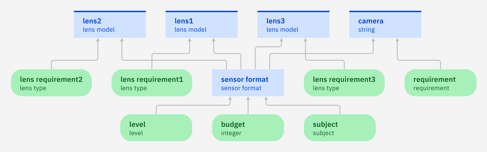
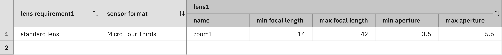
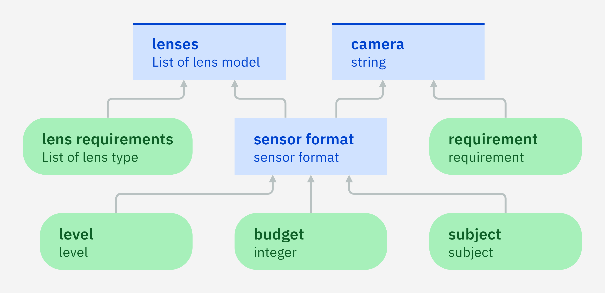
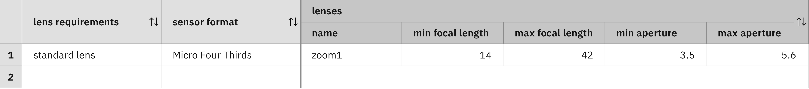

### Applying a decision logic to many values

More complex decision-making problems might involve an arbitrary number
of components and require that a decision is made for each of these
components. You can illustrate this with the help of the camera
recommendation problem. In addition to the camera, some customers might
want to buy a standard lens and a telephoto lens. Other
customers might want a standard lens, a super-telephoto lens,
and a wide-angle lens. Other customers might even want a super
wide-angle lens. For each wanted lens type, a corresponding lens
model needs to be chosen. It is supposed that this decision depends on the
lens type and the sensor format of the camera.

Input data nodes can describe the necessary lens types. For each
possible lens type, there needs to be an input data node in order
to cover all needs. As not all customers want all types of lenses, 
some of these input data nodes can be undefined and have no value.

Furthermore, as a lens model needs to be chosen for each of the input data nodes,
you can introduce a decision node for each of them.  If you consider
five possible lens types, it requires five input data nodes
and five decision nodes. Each decision node depends on one of the
input data nodes as well as the sensor format. All five decision nodes
have the same decision logic, but apply to different lens-type
nodes.

This approach blows up the diagram and leads to the replication of
the same decision logic. If this logic changes, each of its copies
needs to be updated, which is an error-prone process. If the decision model must support further
lens types, then more nodes
need to be added and the decision logic needs to be replicated
again. Due to these problems, the whole approach does not scale
well. Isn't there a more compact and scalable way to 
formulate these decision-making problems?

It is indeed possible to provide an elegant and scalable decision
model for problems with an arbitrary number of components if several
conditions are met. The first condition is that the components are
independent of each other. It means that the other components can be
ignored when a decision is made for a particular component. Each
component thus defines a **subproblem** in which the other components do
not exist!

In the previous example, each wanted lens type defines a subproblem
that consists of

 - the required lens type,
 - the lens model that will be chosen for this lens type,
 - the decision logic according to which this lens model will be
   chosen.
   
Furthermore, each subproblem takes the sensor format of the camera into
account. For example, if you introduce three lens types, three
subproblems of same structure are obtained. Each subproblem has a
node that specifies a lens type, a node that specifies a sensor format, and a
node for choosing a lens model:

 - Subproblem 1 consists in choosing `lensModel1` for
   `lensRequirement1` and `sensor format`.
 - Subproblem 2 consists in choosing `lensModel2` for
   `lensRequirement2` and `sensor format`.
 - Subproblem 3 consists in choosing `lensModel3` for
   `lensRequirement3` and `sensor format`.
   
The second condition requires that all subproblems have the same
decision logic (but applied to different nodes). For example, the
three subproblems can all have the following rule that chooses a lens
model with a focal length of `14:42` and an aperture of `3.5:5.6`:

 - If `lensRequirement1` is a standard lens and `sensor format` is Micro
    Four Thirds then `lensModel1` has a focal length of 14:42 and an
    aperture of 3.5:5.6. 
    
 - If `lensRequirement2` is a standard lens and `sensor format` is Micro
    Four Thirds then `lensModel2` has a focal length of 14:42 and an
    aperture of 3.5:5.6.
    
 - If `lensRequirement3` is a standard lens and `sensor format` is Micro
    Four Thirds then `lensModel3` has a focal length of 14:42 and an
    aperture of 3.5:5.6.

Each of these rules tests whether the nodes for the lens type and
sensor formats have the values `standard lens` and `Micro Four
Thirds`. Moreover, each of the rules assigns the lens model with a
focal length of `14:42` and an aperture of `3.5:5.6` to the lens model
node of the subproblem. As the conditions and actions of these three
rules have the same form, they can be generalized into a universal
rule:

> For each subproblem x: if the lens requirement of x is standard lens
> and the sensor format is Micro Four Thirds then the lens model of x has a
> focal length of 14:42 and an aperture of 3.5:5.6.

All three subproblems have the same decision logic and it is
possible to express them by universal rules. As all three
subproblems have the same form, they can be formulated in a more compact
way.

Automation Decision Services has elegant and simple ways to represent multiple versions of a
subproblem in a compact way. Instead of using multiple input data
nodes for lens types, it is possible to use a single input data
node, called `lens requirements`, that has multiple values. If a
customer wants a standard lens and a telephoto lens, this
node has these two lens types as values. If another customer
wants a standard lens, a super-telephoto lens, and a
wide-angle lens, then this node has these three lens types
as values.

Indeed there are two kinds of nodes and attributes in Automation Decision Services:

 - Single-valued nodes and attributes: They have a single value. The type of
   this value is the type of the node or attribute.
 - Multi-valued nodes and attributes: They have none, one, or
   several values. The type of
   these values is the type of the node or attribute.
 
So far, you used the former and can now use the latter as
well. In addition to a multi-valued input data node for the lens types,
a multi-valued decision node for lens models is introduced, which is
called `lens model`. This decision node collects the lens models that are
decided in the different subproblems. Instead of setting the value of
this decision variable, the rules can add a value
to the multi-valued decision variable through the following action:

    add <value> to decision;
    
In the example, the value is a new lens type where ranges specify the focus length and
aperture. A composite
type, called `range`, which has a minimum and maximum value can express both these values. As such, the
decision is made by the following action:

    add a new lens model where
	    the focal length is a new range where 
            the minimum is 14 , 
            the maximum is 42 ,
        the aperture is a new range where 
            the minimum is 3.5 , 
            the maximum is 5.6
     to decision;
    
Automation Decision Services also has elegant and simple ways to express universal
rules. It is achieved by using quantifiers in the rule language. For
example, you can write

    for each lens type called 'x', in 'lens requirements' 
        <some logic>
    
This construct examines each lens type after the other and applies
the subsequent logic to this lens type. When doing this, other lens
types are ignored. The decision logic in the body of the quantified
statement thus sees only one version of the subproblem and not the
other versions. Hence, the quantifier applies the decision logic to
the different versions of the subproblems independently of each other.
    
For example, the previous universal rule that is given can be expressed as
follows with the help of a quantifier:

    for each lens type called 'x', in 'lens requirements'
        if x is standard lens and 'sensor format' is Micro Four Thirds
        then add a new lens model where
                the focal length is a new range where 
                    the minimum is 14 , 
                    the maximum is 42 ,
                the aperture is a new range where 
                    the minimum is 3.5 , 
                    the maximum is 5.6
             to decision;

#### Exercise 1

Add the following types:

 - an enumeration type `lens type` with values `standard lens`,
   `super-telephoto lens`, `super wide-angle lens`, `telephoto lens`,
   `wide-angle lens`.
 - a composite type `range` for indicating a numeric range. It has two
   numeric attributes: `minimum` and `maximum`.
 - a composite type `lens model` describing a lens model. It has three
   attributes:
   - an attribute `name` of type `string`.
   - an attribute `focal length` of type `range`.
   - an attribute `aperture` of type `range`.
 
Add single-valued nodes to the dependency diagram:

 - three input data nodes of type `lens type`.
 - three decision nodes of type `lens model`. 
 - ensure that each of these new decision node depends on exactly one of the new input data
   nodes and the sensor format as indicated by the diagram:
 

To each of the new decision nodes, add a decision table that suggests a
lens model:

 - in the Decision Table creation wizard, choose the respective lens requirement
   and the sensor format.
 - modify the definition of the lens column by using the following
   snippet and change the labels of the subcolumns into `name`, `min
   focal length`, `max focal length`, `min aperture`, `max aperture`:
    
        set decision to a new lens model where
	        the name is <name> , 
	        the focal length is a new range where 
                the minimum is <a number> , 
                the maximum is <a number> ,
            the aperture is a new range where 
                the minimum is <a number> , 
                the maximum is <a number>

Complete the rows of the table by generally available information about lenses.

For example, the following row suggests a lens of focus length 14:42
and aperture 3.5-5.6 as a standard lens for a Micro Four Thirds
format:

#### Exercise 2

Replace the single-valued nodes about lens type and lens models by multi-valued nodes:

 - an input data node `lens requirements` of type `lens type` and
   multi-valued cardinality.
 - a decision node `lenses` of type `lens model` and multi-valued
   cardinality.
 - ensure that the new decision node depends on the new input data
   node and the sensor format as indicated by the diagram:

Add a decision table recommending lens models:

 - in the Decision Table creation wizard, choose `lens requirements` and `sensor
   model`.
 - ensure that the decision table is applied to each of the lens
   requirements by adding a precondition of the form `for each lens
   type called 'lens type' , in 'lens requirements'`.
 - modify the definition of the `lens requirements` column into `'lens
   type' is <a lens type>` and change the column label into `lens requirements`.
 - modify the definition of the `lenses` column by using the following
   snippet and change the labels of the sub-columns into `name`, `min
   focal length`, `max focal length`, `min aperture`, `max aperture`: 
 
        add a new lens model where
	        the name is <name> , 
	        the focal length is a new range where 
                the minimum is <a number> , 
                the maximum is <a number> ,
            the aperture is a new range where 
                the minimum is <a number> , 
                the maximum is <a number>
        to decision

Complete the table in the same way as in Exercise 1:
 

#### Lessons learned

Even if cases and decisions are composed of an unbounded number of
components, it is possible to represent a decision logic in a compact
way if certain conditions are met:

1. Each decision is made for a selected component of the case
while its other components are ignored. 

2. The decisions are made according to the same decision logics.

If these conditions are met, the decision logic can be expressed in
terms of universal rules, applied to the values of a multi-valued
node. In Automation Decision Services, those rules are formulated with the help of quantifiers.

#### Limitations

This step shows how to apply a decision logic to all values of a
multi-valued node. The method works if this decision logic can be
described by a single decision table. However, the method does not
work if the decision logic is more complex and itself consists of
multiple decision nodes. The [next
step](quiz/quiz.md) shows how to treat these more complex examples.

[Back to ADS concepts step by step](../README.md)
