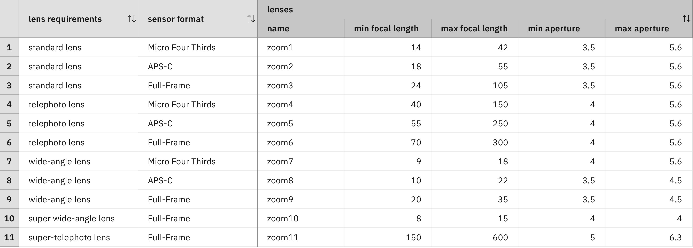
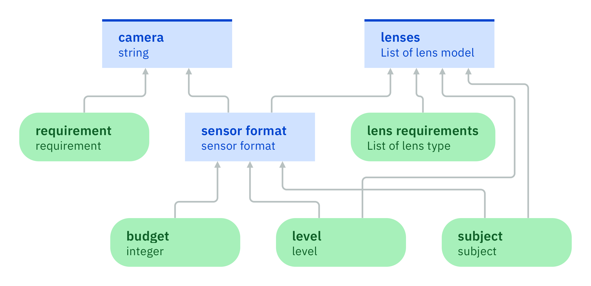
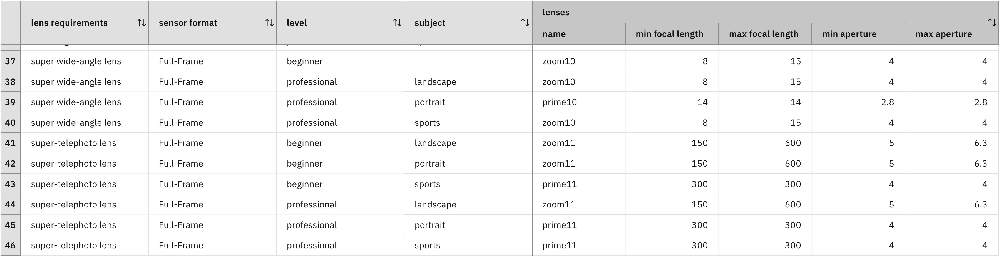
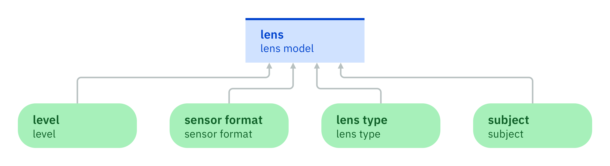
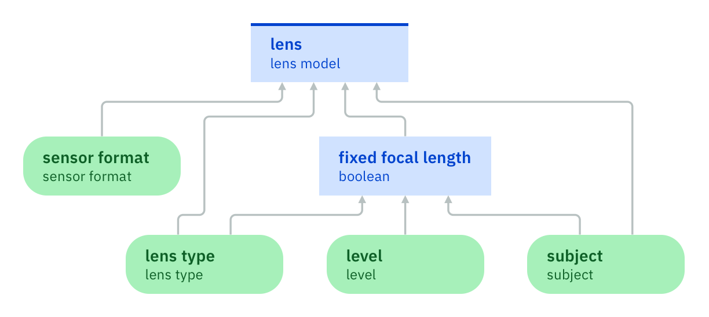
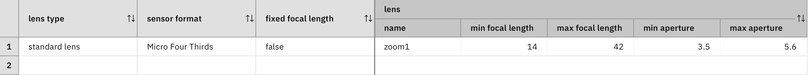

### Applying a decision model to many values

The [previous step](../step6/description.md)
showed you how a decision table can be applied to all values of a
multi-valued variable. It is achieved with the help of a
precondition that iterates over all values of the variable `'lens
requirements'`. In each iteration, the decision table is applied to
the selected value. For example, if the variable `'lens requirements'`
has the values `standard lens` and `super-telephoto lens`, the
decision table is applied to both of them. The decision table
developed in Step 6 has a dedicated column `lens requirements` 
to make a decision that depends on the considered lens type:

In [Step 4](../step4/description.md),
a complex decision logic is decomposed into several pieces with
the help of intermediate decisions. The same principle can be applied
to a decision logic that is applied to all values of a multi-valued
variable. However, the latter leads to an extra difficulty,
which requires a new modeling construct.

To illustrate it, the decision logic is enriched for choosing a lens
model. In the following cases, a fixed-focus lens must be chosen
instead of a zoom lens:

1. A professional photographer who is taking portraits.
2. A super-telephoto lens that is used for sports photography.

According to these new rules, the decision about lens models depends
on the subject and the photographer level in addition to the sensor
format and the lens type. Therefore, the corresponding dependencies enrich the dependency graph.

Based on this, two new columns for the level and subject are added to
the decision table. For standard lenses, telephoto lenses, wide-angle
lenses, and super wide-angle lenses, a fixed-focus lens
is proposed to professional photographers who do portraits. In all
other cases, a zoom lens is proposed.

For super-telephoto lenses, a fixed-focus lens is
proposed to professional photographers who do portraits or sports
photography. It is also proposed to beginners who do sports
photography. In all other cases, a zoom lens is proposed.

These factors result into a decision table with 46 rows. The following excerpt
shows the rows for super wide-angle lenses and super-telephoto
lenses:

As this decision table is quite large, it is desirable to decompose it
into smaller decision tables by following the method explained in
[Step 4](../step4/description.md). This
method replaces a single decision node by multiple decision nodes. It
supposes that the original decision node has a single decision table
without precondition and is not applied to the values of a
multi-valued variable. Hence, it is not possible to directly apply
this decomposition method to the decision table for choosing the lens
models.

However, it is possible to apply the decomposition method when
you refactor the decision model as follows:

1. A new decision model is introduced for choosing a lens model
   depending on the photographer level, the subject, the sensor
   format, and a selected lens type. This submodel has a single
   decision node for choosing the lens model. The decision logic of
   this decision node consists of a variant of the decision table that was
   described previously. This variant has no precondition and the column
   for the lens requirement refers to the selected lens type, which is
   the value of an input data node and not of a local variable that is 
   declared in a precondition.
   
2. In the original decision model, a rule that calls the submodel for
   each value of the multi-valued variable `lens requirements` replaces the decision table with
   precondition .

If the submodel has the name `lens-model`, the rule for calling the
submodel has the following form:

    for each lens type called 'lens type' , in 'lens requirements'
        add the lens-model computed from
            subject being subject ,
            level being level ,
            sensor format being 'sensor format' ,
            lens type being 'lens type' to decision ;

It is now possible to apply the decomposition method that is explained in Step
4 to the submodel.

#### Exercise 1:

Add two dependencies to the dependency graph that is elaborated in Step 6:

 - The decision node `lenses` must depend on the input data node `level`.
 - the decision node `lenses` must depend on the input data node `subject`.
 
Add two condition columns to the decision table of node `lenses` that
refer to the values of the input data nodes `level` and `subject`.

Refine the decision table by duplicating rows and refining them for
different photographer levels and subject:

- For standard lenses, telephoto lenses, and wide-angle lenses,four rows 
  for each sensor format must exist. One row must indicate
  that a beginner receives a zoom lens. The three other rows must
  indicate that a professional photographer receives a zoom lens if
  the subject is landscape or sports and a fixed-focus lens if the subject
  is portrait.
  
- For super wide-angle lenses, four rows for full-frame cameras must exist.
  One row must indicate that a beginner receives a
  zoom lens. The three other rows must indicate that a professional
  photographer receives a zoom lens if the subject is landscape or
  sports and a fixed-focus lens if the subject is portrait.
  
- For super-telephoto lenses, six rows for full-frame
  cameras must exist. Namely, three rows for beginners and three rows for
  professional photographers. A beginner receives a fixed-focus lens for
  sports photography and zoom lenses for landscape and portraits. A
  professional photographer receives fixed-focus lenses for sports
  and portrait photography and a zoom lens for landscape.

The resulting decision table must have 46 rows.

#### Exercise 2

Create a new decision model called `lens-model`:

 - It must have four input data nodes `level`, `subject`, `sensor
   format`, and `lens type`. These nodes are all single-valued.
 - It must have a single decision node `lens` of type `lens
   model`. This node is single-valued as well and depends on all the
   four input data nodes.
   

Add a decision table to the node `lens`:

 - Create the same columns as for the decision table of Exercise 1,
   but do not introduce any precondition.
 - The column for `lens requirement` must refer to the value of the
   node `lens type` instead of the value of a local variable declared
   by a precondition.
 - The action column must set the decision to a new lens model and not
   add a new lens model to the decision.
 - Add the rows and cells from the decision table of Exercise 1.

#### Exercise 3

The choice between zoom and fixed-focus lens depends only on subject,
level, and lens type. 

Refactor the decision model by introducing an intermediate decision
node `fixed focus lens` of type `boolean`:

 - Ensure that the new node `fixed focus lens` depends on the input
   data nodes `subject`, `level`, and `lens type`.
 - Ensure that the decision node `lens model` depends on the new node `fixed focus lens`. 
 - Remove the dependency links between `subject` and `level`,
   and the `lens model`.
   

 
The decision logic of node `fixed focus lens` is best described in terms of rules:

 - A professional photographer who does portrait photography must
   receive a fixed-focus lens.
 - Super-telephoto lenses used for sports photography must be fixed-focus lenses.
 - A zoom lens is proposed in all other cases.
   
Modify the decision table of node `lens model` as follows:

 - Replace the columns for photographer level and subject by a single
   column for the indicator whether a fixed focus lens must be
   given or not. 
 - Keep only two rows for each combination of lens type and sensor format.
 
For example, the following row suggests a lens of focus length 14:42
and aperture 3.5-5.6 as a standard zoom lens for a Micro Four Thirds
format:
 

#### Exercise 4

The last exercise consists in adapting the decision logic of node
`lenses` in the main decision model.

Add a function node to the main model:

 - Choose the decision model that is developed in Exercise 3 for this function node.
 - Create a knowledge requirement between this function node and the decision node `lenses`.
 

Replace the decision logic of the node `lenses` by a single rule:

 - This rule must be applied to all lens types that are values of the node `lens requirements`.
 - The rule must call the submodel developed in Exercise 3 for
   each of these values and add the result to the multi-valued
   decision.
 - The arguments of each invocation are the subject, the level, the
   sensor format, and the lens type.
   
#### Lessons learned

With these submodels, you can apply complex decision logics to values
of multi-valued nodes and other multi-valued language
expressions. However, they can also be used to decompose a complex
decision model into smaller pieces.

#### Limitations

The dependency graph of the main model has two decision nodes that
represent the results of the recommendation. A [final
step](quiz/quiz.md)
shows how to combine them into a single decision node.

[Back to ADS concepts step by step](../README.md)
