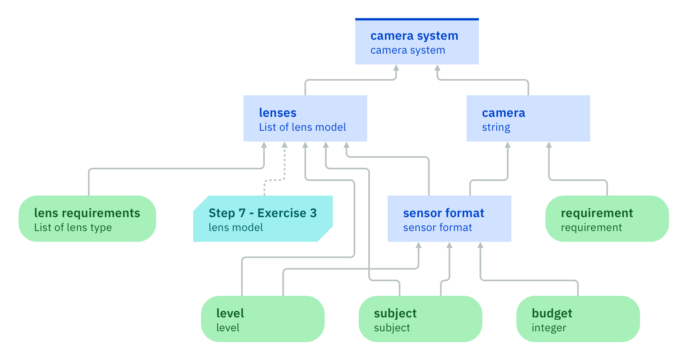

### Discussion of decision models

Decision models have some important properties, which impose requirements on decision logics. 

Consider the final decision model presented in the [last step](../step8/description.md):

After decision making, each input data node and each decision node in this diagram must have a value (or a list of values if the node is multi-valued). For example, the values may be as follows (lists are put into braces): 
- level: beginner
- subject: landscape
- budget: 500
- requirement: 
	- weight limit: 250g
	- equipped with tilt screen: true
- lens requirement: { standard lens }
- sensor format: APS-C
- camera: m4
- lenses: { zoom2 18-55mm f/3.5-5.6 }
- camera system:
	- camera model: m4
	- lens models: { zoom2 18-55mm f/3.5-5.6 }

The values of input data nodes are given, those of decision nodes are determined. The order in which those values are determined does not matter for this discussion. Note that a value of a node cannot be changed once it is determined. In other words, there is only a single state in which each node has its value and it is not necessary to take transitions between different states into account.

Single-valued nodes satisfy the following properties:

1. Each single-valued node has a value. This constitutes the evaluation of the node.
2. The value of a single-valued node belongs to the data type of the node. 
3. The evaluations of the direct predecessors of a single-valued decision node in the dependency diagram uniquely determine the value of the decision node.

As multi-valued nodes have a list of values, their properties are as follows:

1. Each multi-valued node has a (possibly empty) list of values. This constitutes the evaluation of the node.
2. Each value of a multi-valued node must belong to the data type of the node.
3. The evaluations of the direct predecessors of a multi-valued decision node in the dependency diagram uniquely determine the list of values of the decision node.

The last property can be illustrated with the help of two different scenarios where the predecessors have the same values. In addition to the scenario introduced above, consider a second scenario where the values are as follows:
- level: professional 
- subject: sports
- budget: 1499
- requirement: 
	- weight limit: 250g
	- equipped with tilt screen: true
- lens requirement: { telephoto lens }
- sensor format: APS-C
- camera: m4
- lenses: { zoom5 55-250mm f/4-5.6 }
- camera system:
	- camera model: m4
	- lens models: { zoom5 55-250mm f/4-5.6 }

The direct predecessors of the `camera` decision node are the nodes `sensor format` and `requirement`. Both predecessors have the same values in both scenarios. Therefore, the `camera` node must also have the same value in both scenarios. 

Interestingly, this property holds even if some input data nodes such as `level` or `subject` have different values in both scenarios.

The properties listed above imply that each decision node must have a mathematical function that maps values of its direct predecessors to the value of the decision node. This function is called a _decision logic_. In ADS, a decision logic is specified in terms of a rule set. Not every rule set will be able to determine a unique value of the decision node given the values of its direct predecessors. The [next tutorial](../../DecisionLogic/README.md) will discuss what is needed to meet the requirements of a decision logic.

[Back to ADS concepts step by step](../README.md)
