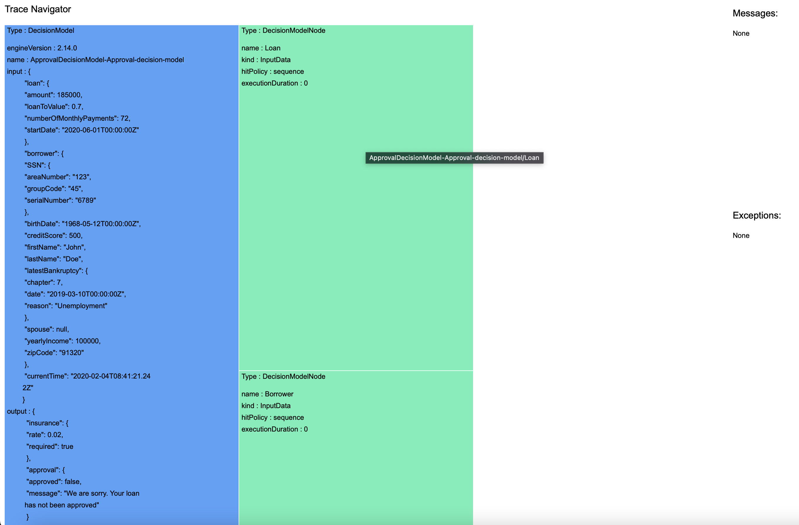

# Sample: Exploring the execution trace

## Description
This sample builds an HTML page to help you explore the content of the execution trace.
The execution trace can be generated when you call a decision service archive. For more information, see the documentation `Execution trace for decision runtime REST API`[](https://www.ibm.com/docs/en/cloud-paks/cp-biz-automation/24.0.1?topic=runtime-execution-trace-decision)[](https://www.ibm.com/docs/en/ads/24.0.1?topic=runtime-execution-trace-decision).

## Learning objectives
- Generate an execution trace.
- Explore its content on an HTML page.

## Audience

This sample is for anyone who wants to explore the execution trace.

## Time required

10 minutes

## Prerequisites
- Automation Decision Services: Your instance of the services must have a decision runtime that supports basic authentication. You must have the hostname and login credentials (username and password) that allow you to manage and execute in the decision runtime. 
For more information about the user roles, see `User roles and access control`[](https://www.ibm.com/docs/en/cloud-paks/cp-biz-automation/24.0.1?topic=runtime-user-permissions-authentication-modes)[](https://www.ibm.com/docs/en/ads/24.0.1?topic=runtime-user-permissions-authentication-modes)
- Apache Maven: A software project management tool that you can download from [Welcome to Apache Maven](https://maven.apache.org).

It is recommended that you do the tutorial `Getting started in Automation Decision Services`[](https://www.ibm.com/docs/en/cloud-paks/cp-biz-automation/24.0.1?topic=resources-getting-started)[](https://www.ibm.com/docs/en/ads/24.0.1?topic=resources-getting-started) before you use this sample.

# Setting up the sample
The decision service used in this sample is `Loan Approval` that is defined in the `Banking` 
sample project. It provides a decision service about approving a loan. First, you build a tool to explore execution traces. Next, you deploy a decision service archive in a decision runtime storage. Finally, you execute it and get execution traces. 

## Building the tool to explore execution traces
You download a repository for the tool for exploring execution traces, and then build an application JAR file.

1. Download a compressed file of the `automation-decision-services-samples` Git repository, and then uncompress it in a directory called `ADSSamples`.
2. Run the following command in the `ADSSamples/samples/ExploreExecutionTraceSample` directory:

```shell
mvn clean compile assembly:single
```

This command builds the library `target/ExploreExecutionTrace-1.0.0-jar-with-dependencies.jar`.

Next, you get an execution trace to explore.

## Deploying the decision service
You use the Swagger UI tool to explore the content of a deployment space, and deploy the decision service archive. 
The name chosen for the deployment space in this sample is `ADSsample`. For more information, see  `Swagger UI documentation`[](https://www.ibm.com/docs/en/cloud-paks/cp-biz-automation/24.0.1?topic=runtime-swagger-ui-decision-api)[](https://www.ibm.com/docs/en/ads/24.0.1?topic=runtime-swagger-ui-decision-api).

1. Open the Swagger UI tool for the decision runtime.
2. Enter the credentials for management.
3. In the **Decision storage management** section, expand `GET /deploymentSpaces/{deploymentSpaceId}/decisions`. Click Try it out.
4. Enter `ADSsample` as the deploymentSpaceId, and click Execute.
5. The response code is 200. If `loanApproval-24.0.1` is in the response list, you can skip the rest and go to the next section **Getting the execution trace**. 

You use the Swagger UI tool for the decision runtime to deploy the decision service archive in the decision runtime storage. 

1. In the **Decision storage management** section, expand `POST /deploymentSpaces/{deploymentSpaceId}/decisions/{decisionId}/archive`. Click Try it out.
2. Enter the following parameters:
   - deploymentSpaceId `ADSsample`.
   - decisionId `loanApproval-24.0.1`.
   - In the request body, browse to the `ADSSamples/archives/loanApproval-24.0.1.jar` archive that you downloaded.
3. Click Execute.
4. The response code is 200. The archive is now deployed. 

Next, you execute the decision service, and get the execution trace.

## Getting the execution trace

You use the Swagger UI tool for the decision runtime to execute the decision service archive you just deployed. You must provide certain parameters to get its execution trace.
1. Expand `POST /deploymentSpaces/{deploymentSpaceId}/decisions/{decisionId}/operations/{operation}/extendedExecute` in the **Decision runtime** section.
2. Enter the following parameters:
   * deploymentSpaceId:`ADSsample`.
   * decisionId: `loanApproval-24.0.1`.
   * operation: `approval`.
3. Set the `input` value in the request body to:
```
   {
     "loan" : {
       "amount" : 185000,
       "numberOfMonthlyPayments" : 72,
       "startDate" : "2005-06-01T00:00:00Z",
       "loanToValue" : 0.7
     },
     "borrower" : {
       "SSN" : {
         "areaNumber" : "123",
         "groupCode" : "45",
         "serialNumber" : "6789"
       },
       "firstName" : "John",
       "lastName" : "Doe",
       "birthDate" : "1968-05-12T00:00:00Z",
       "yearlyIncome" : 100000,
       "zipCode" : "9132",
       "creditScore" : 700
     }
   }
   ```
 4. Set the `executionTraceFilters` value in the request body to:
 ```
   {
       "executionDuration": true,
       "printedMessages": true,
       "decisionModel": {
         "inputParameters": "Object",
         "outputParameters": "Object",
         "inputNode": "None",
         "outputNode": "None"
       },
       "rules": {
         "boundObjectsAtStart": "None",
         "boundObjectsAtEnd": "None",
         "allRules": true,
         "executedRules": true,
         "nonExecutedRules": true,
         "exceptions": "None"
       },
       "ruleflow": {
         "inputParameters": "Object",
         "outputParameters": "Object",
         "allTasks": true,
         "executedTasks": true,
         "notExecutedTasks": true,
         "selectedRules": true
       }
     }

```

5. Run the operation. You get the return code 200. Browse the response body. It contains the following ouput and a complete execution trace. 
```
  "output": {
    "insurance": {
      "rate": 0.0025,
      "required": true
    },
    "approval": {
      "approved": false,
      "message": "The borrower's Zip Code should have 5 digits"
    }
  }
```

6. Download the response body, and put it in the `ADSSamples/samples/ExploreExecutionTraceSample/traces` directory, and then rename it as `trace.json`.

Next, you run the tool to explore the content of the trace.

# Sample details
You generate the HTML page that corresponds to the execution trace, and you explore it in a web browser.

## Navigating to the trace

You use a library to generate an HTML page.

1. Run the following command in the `ADSSamples/samples/ExploreExecutionTraceSample` directory:

```shell
java -jar target/ExploreExecutionTrace-1.0.0-jar-with-dependencies.jar traces/trace.json
```
It generates a file `trace-nav.html`. Next, you explore the execution trace on a dedicated HTML page.

2. Open the `trace-nav.html` file in a web browser. You see the following content on the page:
   - A hierarchical view of the execution units that were executed, to be read from top to bottom and from left to right. 
   The parent execution unit is on the left. All children were executed during the parent execution.
The types of execution unit are: DecisionModel, DecisionModelNode, Rule, ReteEngine, RuleFlow, and Task. Each type of execution unit has a different color. 
   - The messages section for messages that are recorded in the trace during the execution. Click a message to focus the tree view on the block where the message was printed.
   - The exceptions section for exceptions that are recorded in the trace during the execution. Click an exception to focus the tree view on the block where the exception was thrown.

3. Hover over an execution unit to get its execution path, click an execution unit to navigate to it.


