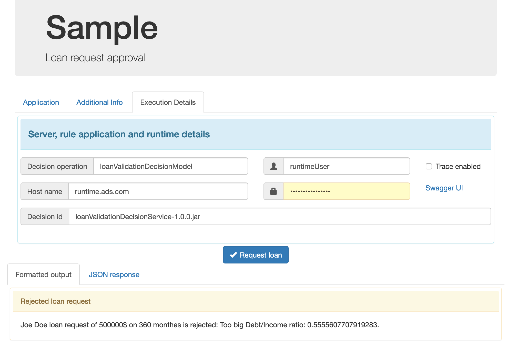

# Sample: Loan Validation application

## Description
This sample shows a web application calling a decision service built into Automation Decision Services. It provides code for a web-based client application which calls a decision service archive to process loan requests. 

## Learning objectives
- Deploy a decision service archive to a production environment.
- Configure a web application to call a decision service archive.
- Run the web application with representative data.
- Explore the execution trace.

## Audience

This sample is for anyone who wants to execute a decision service archive built with Automation Decision Services.

## Time required

15 minutes

## Prerequisites
- Automation Decision Services: Your instance of the services must have a runtime that supports basic authentication. You must have the host name and login credentials (user name and password) allowing management and execution in the runtime. 
For more information on the roles see [User roles and access control](https://www.ibm.com/docs/en/cloud-paks/cp-biz-automation/21.0.x?topic=services-user-roles-authentication-modes)
- Websphere Application Server Liberty: A Java application server that you can download from [Download WAS Liberty](https://developer.ibm.com/wasdev/downloads/). This sample was tested on **WebSphere Liberty Web Profile 8 21.0.0.6**.
- Apache Maven: A software project management tool that you can download from [Welcome to Apache Maven](https://maven.apache.org).

It is recommended that you do the tutorial [Getting started in Automation Decision Services](https://www.ibm.com/docs/SSYHZ8_21.0.x/com.ibm.dba.aid/gs_ddesigner_topics/dba_ddesigner_intro.html) before using this sample.

# Setting up the sample
The web application defined in this sample calls a decision service archive that gives a decision about giving or not a loan. It relies on the decision service Loan Validation defined in the Banking 
sample project. First, you deploy the decision service archive in a runtime storage that should be dedicated to production, then you deploy the web application and execute it giving the appropriate parameters.

## Deploying the decision service
You use the Swagger UI tool to explore the contents of a deployment space and deploy if needed the decision service archive. The name chosen for the deployment space in this tutorial is `ADSsample`.

1. Open the Swagger UI tool of the runtime.
2. Give the credentials for management.
3. In the **Decision storage management** part, expand `GET /deploymentSpaces/{deploymentSpaceId}/decisions`. Click on Try it out.
4. Give `ADSsample` as the deploymentSpaceId and click on Execute.
5. The response code is 200. if `loanApplication-21.0.2` is in the response list, you can directly go to the next part **Building and deploying the client application** else continue.

You use the Swagger UI tool of the runtime to deploy the decision service archive in the runtime `ADSsample` storage.

1. Download the archive [loanValidationDecisionService](../../archives/loanValidationDecisionService-21.0.2.jar)  in a local directory.
2. In the **Decision storage management** part, expand `POST /deploymentSpaces/{deploymentSpaceId}/decisions/{decisionId}/archive`. Click on Try it out.
3. Give the following parameters:
   - deploymentSpaceId `ADSsample`.
   - decisionId `loanApplication-21.0.2`
   - in the request body browse to the `loanValidationDecisionService` archive you downloaded.
4. Click on Execute.
5. The response code is 200. The archive is now deployed. 

You can have a look at the operation name.
1. In the **Decision runtime** part, expand `GET /deploymentSpaces/{deploymentSpaceId}/decisions/{decisionId}/operations`. Click on Try it out.
3. Give the following parameters:
   - deploymentSpaceId `ADSsample`.
   - decisionId `loanApplication-21.0.2`.
4. Click on Execute.
5. The response code is 200. You see the list of operations in the response body: the operation `loan-validation-decision-model` is defined. It will be used by the web application.


## Building and deploying the client application
In this step, you download the repository for the sample application, set properties to match your Automation Decision Services runtime, and build the application WAR file.

1. Download a compressed file of the `automation-decision-services-samples` Git repository.
2. Set the values notes as `TO BE SET` in the file `samples/LoanApplication/src/main/webapp/resources/config.js`:
   - **SERVERNAME**: The name of the host server on which you run the Automation Decision Services runtime, for example, `runtime.ads.com`.
   - **ADSUSERNAME** and **ADSPASSWORD**: The credentials allowing execution for your Automation Decision Services runtime.

   These values are used by default in the user interface of the loan application. The **SPACEID** and **DECISIONID** are set with the values used in this documentation, you may also change them.
3. Edit the file `samples/LoanApplication/pom.xml` to set the property `<liberty-path>` to the path of your Liberty application server.
4. Run the following command in the `samples/LoanApplication` directory:
```
mvn clean install
```
 The command:
 
 - Creates the client application WAR file.
 - Creates and starts a Liberty server.
 - Deploys the client application to the server.

You can use the application when you see the message ``` BUILD SUCCESS```.

**Note:** If you want to modify and build the application again, follow the instructions in the section [Clean this sample](./README.md#clean-this-sample) at the end of this readme.

# Sample details
1. In a browser, open the URL ```http://localhost:9080/loanApplication-1.0-SNAPSHOT/```:


2. Switch to the Execution Details tab.
3. Check that the values for the server name, user name and password are the same as the ones you entered in the config.js file.
4. Click **Request loan**, and look at the results. You can switch to the JSON response to get the full JSON output:



5. Select **Trace Enabled**, and click **Request loan** again to get more details on the execution trace. You can vary the input values to change the results. For example, in the Application tab, if you change the amount to 2000000, you get the message ``` The loan cannot exceed 1000000.```
6. In the Execution Details tab, you can use the Swagger UI link to open the Swagger REST API to the Automation Decision Services runtime. There you can change the trace parameters.

# Clean this sample

When you stop using the application or want to rebuild it, follow these instructions:

- To stop the Liberty server, run the following command in the ```<path to Liberty>/bin``` directory: ```./server stop testADS ```
- To remove the Liberty server, delete the directory ```<path to Liberty>/usr/servers/testADS```.

- To rebuild the sample and create the Liberty server again, run the following command in the `samples/LoanApplication` directory: ```mvn clean install```         
            
- To undeploy the archive:
    1. Open the Swagger UI tool of the runtime.
    2. Give the credentials for management.
    3. In the **Decision storage management** part, expand `DELETE /deploymentSpaces/{deploymentSpaceId}/decisions/{decisionId}/archive`. Click on Try it out.
    4. Give `ADSsample` as the deploymentSpaceId and `loanApplication-21.0.2` as the decisionId .
    5. Click on Execute. The response code is 200, the archive is removed from the deployement space `ADSsample`.
