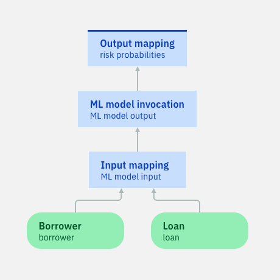

# Tutorial: Using machine learning to make better decisions

## Description

This tutorial shows you how to use a machine learning model in a decision service that validates loans. The decision service uses a decision model to apply policies and incorporate a risk prediction.

In IBM Automation Decision Services, you can create predictive models and use them in decision models. A predictive model can combine machine learning and data from your company's past decisions to determine the possible results of new decisions.  

Each decision service has at least one decision model to map a process for applying policies and data to produce a business decision. By adding a predictive model to a decision service, you can produce more accurate and comprehensive business decisions. 

For more information on decision models and machine learning, see [Modeling decisions](https://www.ibm.com/support/knowledgecenter/SSYHZ8_20.0.x/com.ibm.dba.aid/topics/con_modeling.html) and [Integrating machine learning](https://www.ibm.com/support/knowledgecenter/SSYHZ8_20.0.x/com.ibm.dba.aid/ml_topics/con_integrate_ml.html).

## Learning objectives

   - Create and validate a predictive model that uses a machine learning model.
   - Use this predictive model in a decision model.
   - Build a decision service archive and optionaly run it with curl.

## Audience

This sample is for technical and business users who want to apply predictive analytics through machine learning in decision projects in Automation Decision Services. It also shows data scientists and data engineers how Automation Decision Services can be used to apply machine learning models in decision-making applications.

## Time required

20 minutes

## Prerequisites

Prepare with the following resources:
- [Getting started in Automation Decision Services](https://www.ibm.com/support/knowledgecenter/SSYHZ8_20.0.x/com.ibm.dba.aid/gs_ddesigner_topics/dba_ddesigner_intro.html): This tutorial introduces you to Automation Decision Services.
- [Watson Machine Learning](https://dataplatform.cloud.ibm.com/docs/content/wsj/analyze-data/ml-overview.html?audience=wdp&context=wdp): This service lets you build analytical models and neural networks for use in applications. 

You must have the following environments:
- **Decision Designer**: A web-based user interface for developing decision services in IBM Business Automation Studio. You work with the sample decision service by importing it into a decision project and opening it in Decision Designer.
- **Watson Studio**: A web-based user interface for developing and deploying ML models. 

Download a compressed file of the `automation-decision-services-samples` Git repository to your machine.
Open this [link](https://github.com/icp4a/automation-decision-services-samples) and choose `Download Zip` in the `Code` menu. if you are not using the latest version, switch to the appropriate branch.
The task refers to **automation-decision-services-samples** as the directory where you decompress the repository.

# Procedure
This tutorial offers two paths:
   - [**Short path:**](#short-path-connecting-an-existing-predictive-model) you import a decision service and connect its predictive model to a deployed Machine Learning model.
   - [**Full path:**](#full-path-creating-a-predictive-model) You import a decision service, define a predictive model, and use it in a decision model. Then, you build, deploy, and run a decision service archive.

# Short path Connecting an existing predictive model

In this path, you...
- Deploy a Watson Machine Learning model.
- Import a decision service into a decision project. The decision service contains a predictive model.
- Define a Machine Learning provider.
- Connect the predictive model to the Machine Learning provider.

## Step 1: Deploying the Watson Machine Learning model in Watson Studio

You need to have a deployed machine learning model. For this, you use in Watson Studio:
- either the notebook provided in [`automation-decision-services-samples/samples/MLStart/model/Predict loan default with PMML in WML.ipynb`](https://raw.githubusercontent.com/icp4a/automation-decision-services-samples/tree/20.0.3/samples/MLStart/model/Predict%20loan%20default%20with%20PMML%20in%20WML.ipynb). 
- either the PMML file provided in [`automation-decision-services-samples/samples/MLStart/model/ML-Sample-SGDClassifier-StandardScaler-pmml.xml`](https://raw.githubusercontent.com/icp4a/automation-decision-services-samples/tree/20.0.3/samples/MLStart/model/ML-Sample-SGDClassifier-StandardScaler-pmml.xml). 

You can follow the documentation in [Deployment spaces](https://dataplatform.cloud.ibm.com/docs/content/wsj/analyze-data/ml-spaces_local.html?audience=wdp).
 
Once the model is deployed, you get the following data from Watson Studio to define this ML provider in your ADS Designer solution:
* the space id which is defined in the deployment space settings.
* the URL where the model is deployed. For instance `https://<location>.ml.cloud.ibm.com/ml/v4`.
* the authentication URL. For instance `https://iam.bluemix.net/identity/token`.

You also require an API key that you take from the [cloud](https://cloud.ibm.com/iam/apikeys).

## Step 2: Importing the sample decision service in Decision Designer

You import the sample decision service into a decision project. This decision service applies several criteria in determining a borrower’s eligibility for a loan.
One of the key factors is risk which is predicted by the machine learning model you deployed in Step1.

**Procedure**

1. Sign in to your instance of Business Automation Studio. Use the credentials provided for your instance.
2. Click the **Automation services** box and select Decision.
3. Click Create and select Decision automations to make a project.
4. Enter a name for the project. Use a unique name. Do not reuse the name of a decision project that already exists in your instance of Business Automation Studio. For simplicity, we use **ML Loan Sample** in this sample documentation. After entering your name for the decision project, enter the following description:
**Automated Decision Service sample integrating ML prediction in a Loan Validation decision**. 
5. Click **Create** to make your decision project.
6. Click **Browse samples** in the project, and then select **Machine Learning Start** in the Discovery section. 
7. Click **Import** to import the file into your decision project.
8. In your decision project, click the **ML-based Loan Approval** decision service to open it in Decision Designer.
Take some time to browse through the data model and the decision model. The decision model decides if a loan can be given to a borrower. 
The **Risk Score** node takes as input a prediction node. 
9. Click **ML Loan Sample** in the breadcrumbs to go back to the project.

## Step 3: Defining a machine learning provider

You create a machine learning provider to get your model deployment into your decision project.See [Managing machine learning providers](https://www.ibm.com/support/knowledgecenter/SSYHZ8_20.0.x/com.ibm.dba.aid/ml_topics/tsk_manage_providers.html) for more information.

**Procedure**

1.  Click the three dots next to your project name to open the contextual menu and select **Settings**.
2. Open the Machine learning providers tab. 
3. Click on **New +** to open the Machine Learning provider wizard:
   * Keep Watson ML as the type.
   * Set ml-sample as the name.
   * Enter the description: `Provider for the MLStart tutorial`.
   * Enter the following service credentials you get in Step 1 from Watson Studio to authenticate with your Watson Machine Learning service instance:
     * API key.
     * Space ID.
     * URL.
     * Authentication URL.
   * Click on **Save** to add this provider. Wait for the Status to be Running to have this provider ready to be used in your project.
4. Click **ML Loan Sample** in the breadcrumbs to go back to the project.

## Step 4: Connecting your predictive model 

You connect the predictive model to the  machine learning provider to the provider defined in step 3.

**Procedure**

1. Open the **ML-based Loan Approval** decision service, in the Predictive models tab, click on **loan risk score**. You see that this predictive model is not connected. Open the **output mapping rule** in the **Output mapping** node. In case of an error in the model invocation, it sets a neutral probability. So you can safely run this model and get a result. 
2. Go back to the diagram and click in the diagram background to unselect the **Output mapping** node.
3. Click on **Connect** and choose the **ml-sample** provider you just created.
4. Select the machine learning model: expand the ML model name and click on the deployment name you want to use. 
5. Click **Next** to define the model input schema:
   * if you used in step 1 the provided PMML file to deploy your ML model, it is already complete, so no action is required, go to point 6.
   * if you used in step 1 the provided notebook to deploy your ML model, you have to define an input schema. Two ways are explained, choose one: 
      * _First way_:  select **JSON** and paste the following input schema:
      ```
     {
          "fields": [
              {
                  "name": "creditScore",
                  "nullable": true,
                  "type": "double"
              },
              {
                  "name": "income",
                  "nullable": true,
                  "type": "double"
              },
              {
                  "name": "loanAmount",
                  "nullable": true,
                  "type": "double"
              },
              {
                  "name": "monthDuration",
                  "nullable": true,
                  "type": "double"
              },
              {
                  "name": "rate",
                  "nullable": true,
                  "type": "double"
              },
              {
                  "name": "yearlyReimbursement",
                  "nullable": true,
                  "type": "double"
              }
          ]
      }
     ```
      * _Second way_:  click on **Generate from payload**. Browse to `automation-decision-services-samples/samples/MLStart/model/inputPayload.json` or paste the following payload and click on **OK**.
    ```
   {"input_data":[{"fields":["creditScore","income","loanAmount","monthDuration","rate","yearlyReimbursement"],
                   "values":[[400,100,6767,12,0.7,7878]]}]}
    ```      
6. Click **Next** to define the test invocation. Click **Run** at the right of the wizard to validate the model. You get the following output:
```json
{
    "fields": [
        "probability_0",
        "probability_1",
        "predicted_paymentDefault"
    ],
    "values": [
        [
            0.17825993285555752,
            0.8217400671444425,
            1
        ]
    ]
}
```
7. Click **Next** to define the model output schema. Select **Generate from test output**. Wait for the output schema to be generated and click on **OK**.
8. Click **Apply** to connect the predictive model to this provider. 

Now when you run the predictive model it invokes the ML model deployment. You can navigate to the decision model and run it. 
You can follow the [Full path Task 4](#task-4-deploying-and-running-the-decision-service) to deploy a decision service archive.

# Full path creating a predictive model
In this path, you...
- Set up the tutorial by deploying a ML model, and create a decision project ready to use it.
- Define a predictive model.
- Use this predictive model in a decision model.
- Build, deploy and execute a decision service archive.

## Task 1 : Setting up the tutorial

You use Watson Studio and Decision Designer to set up the tutorial.

**About this task**

In this task, you...
- Deploy a Watson Machine Learning model.
- Import a decision service into a decision project.
- Associate a machine learning provider to a decision project.

### Step 1: Deploying the Watson Machine Learning model in Watson Studio

 You need to have a deployed machine learning model. For this, you use in Watson Studio:
- either the notebook provided in [`automation-decision-services-samples/samples/MLStart/model/Predict loan default with PMML in WML.ipynb`](https://raw.githubusercontent.com/icp4a/automation-decision-services-samples/tree/20.0.3/samples/MLStart/model/Predict%20loan%20default%20with%20PMML%20in%20WML.ipynb). 
- either the PMML file provided in [`automation-decision-services-samples/samples/MLStart/model/ML-Sample-SGDClassifier-StandardScaler-pmml.xml`](https://raw.githubusercontent.com/icp4a/automation-decision-services-samples/tree/20.0.3/samples/MLStart/model/ML-Sample-SGDClassifier-StandardScaler-pmml.xml). 

You can follow the documentation in [Deployment spaces](https://dataplatform.cloud.ibm.com/docs/content/wsj/analyze-data/ml-spaces_local.html?audience=wdp).
 
Once the model is deployed, you get the following data from Watson Studio to define this ML provider in your ADS Designer solution:
* the space id which is defined in the deployment space settings.
* the URL where the model is deployed. For instance `https://<location>.ml.cloud.ibm.com/ml/v4`.
* the authentication URL. For instance `https://iam.bluemix.net/identity/token`.

You also require an API key that you take from the [cloud](https://cloud.ibm.com/iam/apikeys).

### Step 2: Importing the sample decision service in Decision Designer

You import the sample decision service into a decision project. This decision service applies several criteria in determining a borrower’s eligibility for a loan.
One of the key factors is risk which is provided as an input parameter. In the following tasks, you will replace this input parameter by calling the ML model.

**Procedure**

1. Sign in to your instance of Business Automation Studio. Use the credentials provided for your instance.
2. Click the **Automation services** box, and then click **Decision** to see the projects.
3. Click Create and select Decision automations to make a project.
4. Enter a name for the project. Use a unique name. Do not reuse the name of a decision project that already exists in your instance of Business Automation Studio. For simplicity, we use **ML Loan Sample** in this sample documentation. After entering your name for the decision project, enter the following description:
**Automated Decision Service sample integrating ML prediction in a Loan Validation decision.**. 
5. Click **Create** to make your decision project.
6. Click **Import** in the project, and then click on **Browse**. Browse to the downloaded file **automation-decision-services-samples/samples/MLStart/project/ml-sample.zip** and select it.
7. Click **Import** to import the file into your decision project.
8. In your decision project, click the **ML-based Loan Approval** decision service to open it in Decision Designer.
Take some time to browse through the data model and the decision model. The decision model decides if a loan can be given to a borrower. It already takes as input a loan risk score, which is later replaced by the prediction of the machine learning model.
9. Click **ML Loan Sample** in the breadcrumbs to go back to the project.

### Step 3: Adding a new machine learning provider to your project

You associate to your project a new machine learning provider to get your model deployment.See [Managing machine learning providers](https://www.ibm.com/support/knowledgecenter/SSYHZ8_20.0.x/com.ibm.dba.aid/ml_topics/tsk_manage_providers.html) for more information.

**Procedure**

1.  Click the three dots next to your project name to open the contextual menu and select **Settings**.
2. Open the Machine learning providers tab. 
3. Click on **New +** to define a provider:
   * Keep Watson ML as the type.
   * Set ml-sample as the name.
   * Enter the description: Provider for the MLStart tutorial.
   * Enter the following service credentials you get in Step 1 from Watson Studio to authenticate with your Watson Machine Learning service instance:
     * API key.
     * Space ID.
     * URL.
     * Authentication URL.
   * Click on **Save**. Wait for the Status to be Running to have this provider ready to be used in your project.
4. Click **ML Loan Sample** in the breadcrumbs to go back to the project.
## Task 2: Defining a predictive model

You define a predictive model to use your ML model in your project.

**About this task**

In this task, you...
- Create a predictive model in your decision solution.
- Edit its input and output mapping to fit to the data model. 
- Validate the results.

### Step 1: Creating a predictive model

You create a predictive model in your decision service to encapsulate your machine learning model.

**Procedure**

1. In your decision project, click the **ML-based Loan Approval** decision service to open it in Decision Designer.
2. Open the **Predictive models** tab, and then click **Create**.
3. Give the name **Loan risk score** and click **Create** to make your predictive model.
4. The predictive model opens. On the left part, it is indicated **Not connected**. Click on **Connect** to connect it to the provider where your model deployment is stored. 
5. Click on **Select a provider** and choose **ml-sample**.
6. Select the machine learning model: expand the ML model name and click on the deployment name you want to use. 
7. Click **Next** to define the model input schema:
   * if you used in step 1 the provided PMML file to deploy your ML model, it is already complete, so no action is required, go to point 8.
   * if you used in step 1 the provided notebook to deploy your ML model, you have to define an input schema in two different ways:
      * _First way_:  select **JSON** and paste the following input schema:
      ```
     {
          "fields": [
              {
                  "name": "creditScore",
                  "nullable": true,
                  "type": "double"
              },
              {
                  "name": "income",
                  "nullable": true,
                  "type": "double"
              },
              {
                  "name": "loanAmount",
                  "nullable": true,
                  "type": "double"
              },
              {
                  "name": "monthDuration",
                  "nullable": true,
                  "type": "double"
              },
              {
                  "name": "rate",
                  "nullable": true,
                  "type": "double"
              },
              {
                  "name": "yearlyReimbursement",
                  "nullable": true,
                  "type": "double"
              }
          ]
      }
     ```
      * _Second way_:  click on **Generate from payload**. Browse to automation-decision-services-samples/samples/MLStart/model/inputPayload.json or paste the following payload and click on **OK**.
    ```
   {"input_data":[{"fields":["creditScore","income","loanAmount","monthDuration","rate","yearlyReimbursement"],
                   "values":[[400,100,6767,12,0.7,7878]]}]}

    ```      
8. Click **Next** to define the test invocation. Click **Run** at the right of the wizard to validate the model. You get the following output:
```json
{
    "fields": [
        "probability_0",
        "probability_1",
        "predicted_paymentDefault"
    ],
    "values": [
        [
            0.17825993285555752,
            0.8217400671444425,
            1
        ]
    ]
}
```
9. Click **Next** to define the model output schema. Select **Generate from test output**. Wait for the output schema to be generated and click on **OK**.
10. Click **Apply** to connect the predictive model to this provider.

### Step 2: Editing the input and output mapping.

You edit the input and output mapping of your predictive model to use the decision service data model.

**Procedure**

1. Define the input nodes:
    
    a. Click the **Input type** node. Change its name to **Loan** and its output type to **loan**.
    
    b. Hover over the **Loan** node and click on the `Copy node` icon to duplicate it. Change its name to **Borrower** and set its output type to **borrower**.
    
2. Define the input mapping rule:
    
    a. Click the **Input mapping** node. Go to the **Logic** tab and add a new business rule. Name it **input mapping rule**. You do not need to select any criteria for this rule. Click **Create**.
    
    b. In the rule content, enter the following code:
    ```
    definitions
    set 'duration' to the number of monthly payments of Loan ;
    set 'rate' to the rate of Loan ;
    set 'yearlyreimbursement' to  'rate'  * the amount of Loan  / (1 - pow ( 1 + 'rate' , -duration));
    then
        set decision to a new ML model input where
            the creditscore is the credit score of Borrower , 
            the income is the yearly income of Borrower , 
            the loanamount is the amount of Loan , 
            the monthduration is the number of monthly payments of Loan , 
            the rate is 'rate' , 
            the yearlyreimbursement is 'yearlyreimbursement' ;
    ```
    
    c. Go back to the diagram.
    
3. Define the output mapping rule:    
    
    a. Select the **Output mapping** node. In the Details tab, set its type to **risk probabilities**.
    
    b. Go to the **Logic** tab, and add a new business rule. Name it **output mapping rule**. Click **Create**.
    
    c.  In the rule content, enter the following code:
    ```
    if 'ML model invocation' is in error
     then 
    set decision to a new risk probabilities where
        the payment default is 0,
            the probability is 1 ;
    else 
    set decision to a new risk probabilities where
        the payment default is the predicted paymentdefault of 'ML model invocation' , 
        the probability is max ( the probability0 of 'ML model invocation' , the probability1 of 'ML model invocation' );
    ```
    
    d. Go back to the diagram.
    

### Step 3: Running the predictive model.
You add and run data sets to validate your predictive model.

**Procedure**

1. Go to the **Run** tab.
2. Click the **+** button to add a new test scenario. Change its name to **John Good Score**.
3. Edit its content as JSON. Enter the following data:
    ```json
    {
      "loan": {
        "rate": 0.7,
        "number of monthly payments": 72,
        "amount": 185000
      },
      "borrower": {
        "credit score": 750,
        "yearly income": 1000000,
        "first name": "John"
      }
    }
    ```
 4. Click **Run** to execute your predictive model. The Result shows that there is no risk.
 5. Click the **+** button to add another test scenario. You can change the name to **Paul Bad Score** and enter the data as JSON:
    ```json
    {
      "borrower": {
        "credit score": 100,
        "yearly income": 100000,
        "first name": "Paul"
      },
      "loan": {
        "number of monthly payments": 72,
        "amount": 520000,
        "rate": 0.7
      }
    }
    ```
6. Click **Run** to validate your predictive model. The Result shows that there is a risk.

## Task 3: Using the predictive model in the decision model

You use the predictive model in the sample decision model.

**About this task**

In this task, you...
- Edit the decision model to replace a user input node with a function node that calls your predictive model.
The computed prediction value is stored in a variable so that it can be used in several rules. 
- Run your decision model.

**Procedure**

1. In the breadcrumbs, click **ML-based Loan Approval** to go back to the decision service view. Click the decision model **Loan Validation Decision Model**.
2. Remove the **Loan Risk Score** node.
3. Click Add prediction to add a new prediction node. Click **Select a predictive model** to select Loan risk score.
4. Connect the new prediction node to the **Risk score** node.
5. Select the **Risk Score** node. Go to the **Logic** tab and edit the **loan risk score** rule. Enter the following rule:
    ```
    set decision to the loan risk score computed from 
    Borrower being Borrower , 
    Loan being Loan; 
    ```
 Here is the new model:
    

6. Run your decision model. Go to the **Run** tab and run both the 'John Good Score' and 'Paul Bad Score' tests.

## Task 4 Deploying and running the decision service

You connect your project to a GitHub repository. Then you deploy a decision service archive to be able to execute it.

**About this task**

In this task, you...
- Connect the **ML-based Loan Approval** decision service to a Git repository. 
- Create a new version of your project.
- Deploy your decision service archive.
- Optionaly, run the decision service archive using a curl command.

Note that those steps are more detailed in task 5 of [Getting started in Automation Decision Services](https://www.ibm.com/support/knowledgecenter/SSYHZ8_20.0.x/com.ibm.dba.aid/gs_ddesigner_topics/dba_ddesigner_intro.html).

**Procedure**

1. Create a new repository on GitHub, get its URI and the credentials to access it.
3. Connect your decision project to this Git repository. 
4. In the **Share changes** tab, select the **ML-based Loan Approval** decision project.
5. Click **Share** to share your changes in the Git repository.
6. In the **View history** tab, create a new version with the name FirstVersion.
7. In the **Deploy** tab, deploy this version. Wait for the deployment to be completed.
8.  If you want to run your decision service archive, copy the decision path by clicking on the Copy icon. Remove the `/execute` at the end. It looks like
`/api/v1/decision/decisions%2Fml_loan_sample%2Fml_based_loan_approval%2FML-BasedLoanApprovalDecisionService%2FFirstVersion%2FML-BasedLoanApprovalDecisionService-FirstVersion.jar`
9. Get an access token to be able to call the runtime:
      - In the deployment page, open the Developers tools,
      - Open the Storage tab
      - Expand Local storage, and select the URL of your ADS instance note the value of the access_token.
10. In a terminal, call the following command where you replace `<ACCESS TOKEN>`, `<ADS embedded runtime URL>` and `<Decision path>` by the appropriates values
   
  ``` 
  curl --insecure -v -H "Authorization: Bearer <ACCESS TOKEN>" \
   -X POST "https://<ADS embedded runtime HOST><Decision path>/operations/loanValidationDecisionModel" \
   -H "accept: application/json" -H "Content-Type: application/json" \
   -d "{\"input\":{\"loan\":{\"number of monthly payments\":72,\"start date\":\"2020-12-30\", \
                            \"amount\":185000,\"rate\":0.7}, \
                    \"borrower\":{\"first name\":\"John\",\"last name\":\"Doe\",\"birth date\":\"1968-05-12\", \
                             \"SSN\":{\"area number\":\"123\",\"group code\":\"45\",\"serial number\":\"6789\"}, \
                              \"yearly income\":1000000,\"zip code\":\"91320\",\"credit score\":750}, \
                     \"currentTime\":\"2020-12-10\"}}" -k
```
   
 You get the following response
 
``` 
...
{"output":{"insurance":{"required":true,"rate":0.002},"approval":{"approved":true,"message":"Congratulations! Your loan has been approved"}},
...
``` 
