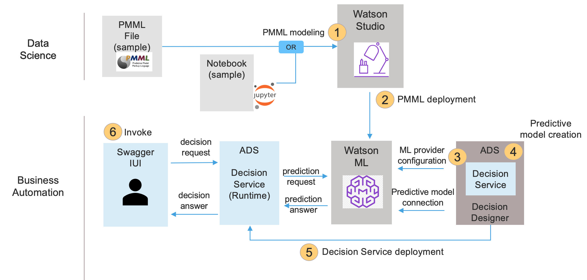
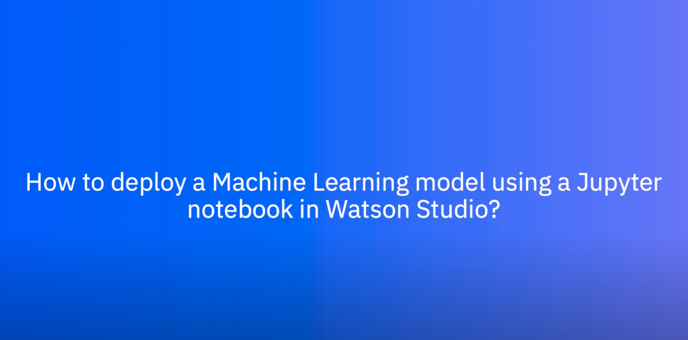

# Tutorial Complete: Using machine learning to make better decisions

## Description


This tutorial shows you how to create a predictive model in Automation Decision Services, connect it to a Watson Machine Learning provider, use it in a decision service that validates loans, deploy the service and execute it in Swagger UI. The decision service uses a decision model to apply policies and incorporate a risk prediction. These tutorial tasks are illustrated in the following diagram.



For more information on decision models and predictive models, see [Modeling decisions](https://www.ibm.com/docs/en/cloud-paks/cp-biz-automation/22.0.2?topic=automations-developing-decision-services) and [Integrating machine learning](https://www.ibm.com/docs/en/cloud-paks/cp-biz-automation/22.0.2?topic=services-integrating-machine-learning).

For more tutorials about machine learning in Automation Decision Services see:
   - [Machine learning quick tutorial](../MachineLearningQuickTutorial/README.md) to learn how to import a Machine Learning Model as PMML file in an Automation Decision Services Machine Learning Service and how to connect it to a predictive model.
   - [Machine learning short tutorial](../MachineLearningShortTutorial/README.md) to learn how to connect a predictive model to a Watson Machine Learning Model. 
   - [Machine learning customer loyalty sample](../MachineLearningCustomerLoyaltySample/README.md) to get another example using two predictive models.

## Learning objectives

   - Build a Watson Machine Learning (WML) model using a PMML file or a notebook, deploy this model to Watson Machine Learning.
   - Create a WML provider in Decision Designer.
   - Create a predictive model and connect it to a machine learning deployment.
   - Use this predictive model in a decision model.
   - Deploy a decision service using this predictive model.
   - Execute a decision using Swagger UI. 

## Audience

This sample is for technical and business users who want to apply predictive analytics through machine learning in decision services in Automation Decision Services. It also shows data scientists and data engineers how Automation Decision Services can be used to apply machine learning models in decision-making applications.

## Time required

40 minutes

## Prerequisites

Prepare with the following resources:
- [Getting started in Automation Decision Services](https://www.ibm.com/docs/en/cloud-paks/cp-biz-automation/22.0.2?topic=resources-getting-started-tutorial): This tutorial introduces you to Automation Decision Services.
- [Watson Machine Learning](https://dataplatform.cloud.ibm.com/docs/content/wsj/analyze-data/ml-overview.html?audience=wdp&context=wdp): This service lets you build analytical models and neural networks for use in applications. 

You must have the following environments:
- **Decision Designer**: A web-based user interface for developing decision services in Business Automation Studio. 
- **Watson Studio**: A web-based user interface for developing and deploying machine learning models. 

In this tutorial, you...
- Define a machine learning model using Watson Studio.
- Deploy a machine learning model in Watson Machine Learning.
- Define a machine learning provider using Watson Machine Learning.
- Define and connect a predictive model to a machine learning model deployed in Watson Machine Learning.
- Use this predictive model in a decision model.
- Build, deploy and execute a decision service archive.

# Task 1: Defining and deploying a machine learning model in Watson Machine Learning.

**About this task**

In this task, you...
- Define a machine learning model using a PMML file or a notebook in Watson Studio.
- Deploy this model in Watson Machine learning.

**Procedure**
1. You define a machine learning model using:
   - either the PMML file provided in [`automation-decision-services-samples/samples/MachineLearningCompleteTutorial/model/ML-Sample-SGDClassifier-StandardScaler-pmml.xml`](model/ML-Sample-SGDClassifier-StandardScaler-pmml.xml).
   - or the notebook provided in [`automation-decision-services-samples/samples/MachineLearningCompleteTutorial/model/Predict loan default with PMML in WML.ipynb`](model/Predict%20loan%20default%20with%20PMML%20in%20WML.ipynb). 
2. You deploy this model in Watson Machine Learning, you can follow the documentation in [Deployment spaces](https://dataplatform.cloud.ibm.com/docs/content/wsj/analyze-data/ml-spaces_local.html?audience=wdp).

Click the following image to watch a video showing how to deploy a machine learning model using this sample notebook:

[](https://youtu.be/bbEZk4ypRQU&ab_channel=IBMSupportandTraining)

If the notebook is used to deploy, begin by reading it. Then update the following values inside before running it:
  - url: your Watson Machine Learning API endpoint URL.
  - apikey: see below for more information on how to get it.
  - space_id: your deployment space id.
    
  Then run the notebook to build and deploy the ML model.
  
3. When the model is deployed, you get the data from Watson Studio that is required to define a machine learning provider in your decision project in Task 2. You need:
* the space id which is defined in the deployment space settings.
* the URL where the model is deployed. For instance `https://<location>.ml.cloud.ibm.com/ml/v4`.
* the authentication URL. For instance `https://iam.bluemix.net/identity/token`.

You also require an API key that you take from the [cloud](https://cloud.ibm.com/iam/apikeys).

# Task 2: Defining a machine learning provider in Decision Designer

**About this task**

In this task, you...
- Import and explore a sample decision service.
- Define a machine learning provider using Watson Machine Learning.

## Step 1: Importing the sample decision service in Decision Designer

You import a sample decision service into a project. This decision service applies several criteria in determining a borrower’s eligibility for a loan.
One of the key factors is risk which is predicted by the machine learning model.

**Procedure**

1. Use the credentials provided for your instance to sign in to Decision Designer.
2. Create a new project and import the `Machine learning complete tutorial - Loan approval` sample from the list of Discovery tutorials.
3. Click `Complete machine learning loan approval` to open the decision service.

**Discovery**

Take a moment to look at the imported decision service.

1. Open the `Loan Validation Data` data model in the `Data` tab to browse the defined types. <br>
   The `risk probabilities` type is used by the predictive model.
2. Click on the decision service name in the breadcrumbs and open the decision model `Loan Validation Decision Model`: it decides if a loan can be given to a borrower. One of the key decision is the risk computed in
the `Risk Score` node. It takes a `Loan Risk Score ` value. You will change this part to use a predictive model predicting the risk.

Next you will define a machine learning provider to be able to access the machine learning model you deployed in Task 1.

### Step 2: Defining a machine learning provider

You associate to your project a new machine learning provider to get your model deployment. See [Managing machine learning providers](https://www.ibm.com/docs/en/cloud-paks/cp-biz-automation/22.0.2?topic=learning-managing-local-machine-providers) for more information.

**Procedure**

1. Click on the project name in the breadcrumbs to go back to your project.
2. Click on the **Settings** icon at the page top right corner.
3. Open the Machine learning providers tab. 
4. Click on **New +** to define a provider:
   * Keep `Watson ML` as the type.
   * Set `wml-complete` as the name.
   * Enter the description: `Provider for the machine learning complete tutorial`.
   * Enter the following service credentials you obtained in Task 1 from Watson Studio to authenticate with your Watson Machine Learning service instance:
     * API key.
     * Space ID.
     * URL.
     * Authentication URL.
   * Click on **Save**. Wait for the Status to be Running to have this provider ready to be used in your project.
5. Click on the project name in the breadcrumbs to go back to the project.

## Task 3: Defining and using a predictive model

You define a predictive model to use your machine learning model in your decision service.

**About this task**

In this task, you...
- Create a predictive model in your decision service.
- Define its input and output mapping to fit to the data model. 
- Run the predictive model.
- Use the predictive model in a decision model.

### Step 1: Creating and connecting a predictive model

You create a predictive model connected to your machine learning model deployment in your decision service.

**Procedure**

1. In your project, click the **Complete machine learning loan approval** decision service to open it.
2. In the Models tab, click on **Create**.
3. Select **Predictive model type**, give the name **Loan risk score** and click **Create** to make your predictive model. The predictive model opens.
4. On the right part, it is indicated **Not configured**. Click on **Configure** to connect it to the provider where your machine learning model is deployed.
5. Keep **Remote Machine Learning Model** method selected and click **Next**.
6. Click on **Select a provider** and choose `wml-complete`.
7. Select the machine learning model: expand the machine learning model name you chose in Task 1 and click on the deployment name you want to use. 
8. Click **Next** to define the model input schema: it is complete, just browse it.
9. Click **Next** to define the test invocation. Click **Run** at the right of the wizard to validate the model. You get the following output:
```json
{
  "fields": [
      "probability_0",
      "probability_1",
      "predicted_paymentDefault"
  ],
  "values": [
      [
          0.17825993285555802,
          0.821740067144442,
          1
      ]
  ]
}
```
The values may differ if :
- you used the notebook in Task 1, because the model has been trained again,
- you used the PMML, because the precision is not the same each time.
10. Click **Next** to define the model output schema. Select **Generate from test output**. Wait for the output schema to be generated and click on **OK**.
11. Click **Apply** to connect the predictive model to this provider.

Next you define the input and the output of the machine learning model.

### Step 2: Editing the input and output mapping

In this step, you...
- provide the input schema expected by the machine learning model. For this you define rules to map the decision service data model to the expected input data.
- define the output of your predictive model from the output schema of the machine learning model.

**Procedure**

1. Define the input nodes:   
    a. Click on the **Input** node. Change its name to **Loan** and its output type to **loan**.  
    b. Hover over the **Loan** node and click on the `Copy node` icon to duplicate it. Change its name to **Borrower** and set its output type to **borrower**.
    
2. Define the input mapping rule:    
    a. Click the **Input mapping** node. Go to the **Logic** tab and add a new business rule. Name it **input mapping rule**. You do not need to select any criteria for this rule. Click **Create**.   
    b. In the rule editor, enter the following code:
    ```
    definitions
    set 'duration' to the number of monthly payments of Loan ;
    set 'rate' to the rate of Loan ;
    set 'yearlyreimbursement' to  'rate'  * the amount of Loan  / (1 - pow ( 1 + 'rate' , -duration));
    then
        set decision to a new ML model input where
            the creditscore is the credit score of Borrower , 
            the income is the yearly income of Borrower , 
            the loanamount is the amount of Loan , 
            the monthduration is the number of monthly payments of Loan , 
            the rate is 'rate' , 
            the yearlyreimbursement is 'yearlyreimbursement' ;
    ```   
    c. Go back to the diagram.
    
3. Define the output mapping rule:       
    a. Select the **Output mapping** node. In the Details tab, set its type to **risk probabilities**.    
    b. Go to the **Logic** tab, and add a new business rule. Name it **output mapping rule**. Click **Create**.   
    c.  In the rule editor, enter the following code:
    ```
   if 'ML model invocation' is in error
     then 
    set decision to a new risk probabilities where
        the payment default is 0,
            the probability is 1 ;
    else 
    set decision to a new risk probabilities where
        the payment default is the predicted paymentdefault of 'ML model invocation' , 
        the probability is max ( the probability0 of 'ML model invocation' , the probability1 of 'ML model invocation' );
    ```
    
    d. Go back to the diagram.
    
    

### Step 3: Running the predictive model
You add and run data sets to validate your predictive model.

**Procedure**

1. Go to the **Run** tab.
2. Click the **Add test data set +** button to add a new test scenario. Change its name to **John Good Score**.
3. Edit its content as JSON. Enter the following data:
```json
{
  "loan": {
    "rate": 0.7,
    "numberOfMonthlyPayments": 72,
    "amount": 185000
  },
  "borrower": {
    "creditScore": 750,
    "yearlyIncome": 1000000,
    "firstName": "John"
  }
}
```
 4. Click **Run** to validate your predictive model. The result shows that there is no risk.
 5. Click the **Add test data set +** button to add another test scenario. You can change the name to **Paul Bad Score** and enter the following data as JSON:
```json
{
  "borrower": {
    "creditScore": 100,
    "yearlyIncome": 100000,
    "firstName": "Paul"
  },
  "loan": {
    "numberOfMonthlyPayments": 72,
    "amount": 520000,
    "rate": 0.7
  }
}
```
6. Click **Run** to validate your predictive model. The results show that there is a risk.

### Step 4: Using the predictive model in the decision model

You edit the decision model to replace an input node with a prediction node calling your predictive model. The computed prediction value is stored in a variable so that it can be used in several rules. 

**Procedure**

1. In the Navigation history, select **Loan Validation Decision Model** to open the decision model.
2. Remove the **Loan Risk Score** node.
3. Hover on the `Risk score` node and click on  **Add prediction**. Click **Select a predictive model** to select `Loan risk score`.
4. Select the **Risk Score** node. Go to the **Logic** tab and edit the **loan risk score** rule. Enter the following rule:
    ```
    set decision to the loan risk score computed from 
    Borrower being Borrower , 
    Loan being Loan; 
    ```
5. Go back to the diagram. Here is the new model:
    

6. Run your decision model. Go to the **Run** tab and run both the 'John Good Score' and 'Paul Bad Score' tests.

## Task 4: Deploying and invoking the decision service

You connect your project to a GitHub repository to be able to deploy a decision service archive. Then you invoke your decision using the Swagger UI tool. 

**About this task**

In this task, you...
- Connect the **Machine learning complete** project to a Git repository. 
- Create a new version of your project.
- Deploy your decision service archive.
- Invoke the decision service archive by using the Open Api generated by the runtime.
- Check the metadata defined for your archive.

### Step 1: Deploying the decision service

You deploy the decision service. Note that those steps are more detailed in Task 2 and Task 6 of [Getting started in Automation Decision Services](https://www.ibm.com/docs/en/cloud-paks/cp-biz-automation/22.0.2?topic=resources-getting-started-tutorial).
If Decision Designer is configured to automatically create a Git repository to be connected to, you can use this git repo and skip points 1,2 and 3 in the following procedure. See [Connecting to a remote repository automatically](https://www.ibm.com/docs/en/cloud-paks/cp-biz-automation/22.0.2?topic=decisions-connecting-remote-repository-automatically).

**Procedure**

1. Create a new repository on GitHub, get its URI and the credentials to access it.
2. In Decision Designer, click on the project name in the breadcrumb to go back to the project.
3. Connect your project to the Git repository you created in point 1 and go back to the project clicking on the project name in the breadcrumb.
4. In the **Share changes** tab, select the **Complete machine learning loan approval** decision service.
5. Click **Share** to share your changes in the Git repository.
6. In the **Deploy** tab, click the suggested `create version` from the latest change and create your version.
7. Expand the created version and click **Deploy** at the end of the row for your decision service. Wait for the deployment to finish.
8. Copy the decision ID you will use it in step 3 to get the metadata.
9. Click on `{...}` at the end of the row of your decision service deployment. The Swagger UI of Automation Decision Service runtime opens.

### Step 2: Executing the decision service

You execute the decision service archive using Swagger UI.

**Procedure**

1. In the Decision runtime part, expand **POST /loan-validation-decision-model/execute**. Click on **Try it out** at the end of the line.
2. Use the following schema in the request body:
```json 
{
  "loan": {
    "numberOfMonthlyPayments": 72,
    "startDate": "2020-06-01",
    "amount": 185000,
    "rate": 0.7
  },
  "borrower": {
    "firstName": "John",
    "lastName": "Doe",
    "birthDate": "1968-05-12",
    "SSN": {
      "areaNumber": "123",
      "groupCode": "45",
      "serialNumber": "6789"
    },
    "yearlyIncome": 1000000,
    "zipCode": "91320",
    "creditScore": 750
  },
  "currentTime": "2020-02-03"
}
```
3. Click on **Execute**. You get the following response body:
```json
{
  "insurance": {
    "required": true,
    "rate": 0.02
  },
  "approval": {
    "approved": true,
    "message": "Congratulations! Your loan has been approved"
  }
}   
```

### Step 3: Checking the metadata associated to your decision

You verify the metadata containing the machine learning provider. Those metadata were generated by Decision Designer. You may have to change them if your provider credentials change.
Note also that you have to define those metadata in case you deploy the decision service archive to another deployment space.
You need to have credentials allowing management in the Automation Decision Services runtime.
For more information about the metadata, see [Decision service metadata](https://www.ibm.com/docs/en/cloud-paks/cp-biz-automation/22.0.2?topic=services-decision-service-metadata).

**Procedure**
1. Get the runtime Swagger UI url from your IT. You should be authenticated.
2. In the Decision storage management part, expand **GET /deploymentSpaces​/{deploymentSpaceId}​/decisions​/{decisionId}​/metadata**.
3. Click on **Try it out** at the end of the line, enter the following input values and click on Execute:
    - **deploymentSpaceId**: embedded
    - **decisionID**: the one you copied in the Step 1.  
In the response body, you get the description of the machine learning provider:

```
{
 ...
    "<USER_ID>/<PROJECT_NAME>/wml-completeXXXXXX": {
      "name": "<USER_ID>/<PROJECT_NAME>/wml-completeXXXXXX",
      "kind": "ENCRYPTED",
      "readOnly": false,
      "value": {
        "name": "<USER_ID>/<PROJECT_NAME>/wml-completeXXXXXX",
        "type": "WML",
        "description": "Provider for the machine learning complete tutorial",
        "mlUrl": "<ML_URL>",
        "authUrl": "<AUTH_URL>",
        "instanceId": "<INSTANCE_ID>",
        "apiKey": "<API_KEY>"
      }
...
```
You've completed this tutorial.
For more tutorials about machine learning in Automation Decision Services see:
   - [Machine learning quick tutorial](../MachineLearningQuickTutorial/README.md) to learn how to import a Machine Learning Model as PMML file in an Automation Decision Services Machine Learning Service and how to connect it to a predictive model.
   - [Machine learning short tutorial](../MachineLearningShortTutorial/README.md) to learn how to connect a predictive model to a Watson Machine Learning Model. 
   - [Machine learning customer loyalty sample](../MachineLearningCustomerLoyaltySample/README.md) to get another example using two predictive models.

Note that the [**Open Prediction Service Hub repository**](https://github.com/IBM/open-prediction-service-hub) contains material and guidelines related to implementing Open Prediction Service API services.
For instance, you can use the [Build a Loan default score model with OPS.ipynb](https://github.com/IBM/open-prediction-service-hub/blob/main/notebooks/OPS/Build%20a%20Loan%20default%20score%20model%20with%20OPS.ipynb) notebook to deploy a model in OPS and use it in a predictive model in Decision Designer.
