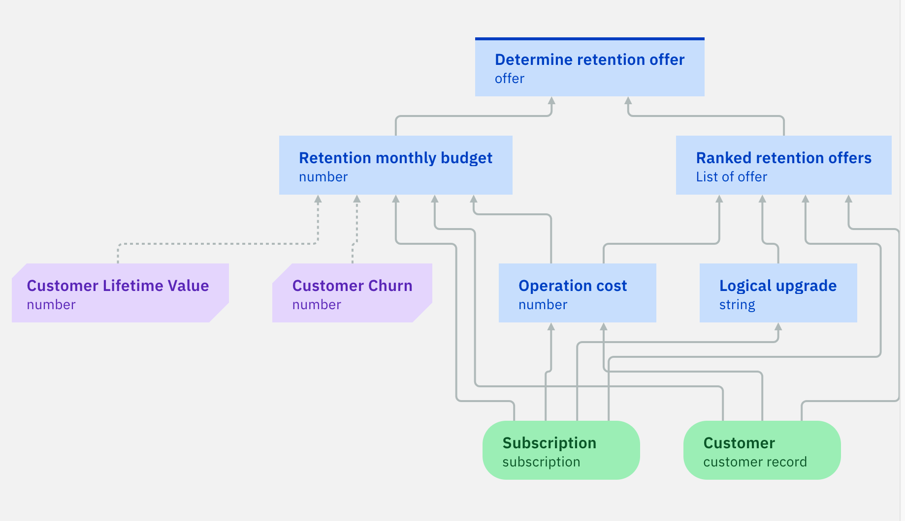

# Sample: Machine Learning Customer Loyalty

## Description

This sample uses a decision service that recommends a retention offer based on predicted customer churn and lifetime value. 
Those predictions are made using two predictive models connected to Watson Machine Learning models deployed with AutoAI.

For more information on decision models and predictive models, see [Modeling decisions](https://www.ibm.com/docs/en/cloud-paks/cp-biz-automation/22.0.2?topic=automations-developing-decision-services) and [Integrating machine learning](https://www.ibm.com/docs/en/cloud-paks/cp-biz-automation/22.0.2?topic=services-integrating-machine-learning).

## Learning objectives
   - Build a Watson Machine Learning (WML) model and deploy it using an AutoAI experiment.
   - Create a WML provider and connect it to a predictive model.
   - Run a decision model using this predictive model.

## Audience

This sample is for technical and business users who want to apply predictive analytics through machine learning in decision services in Automation Decision Services. It also shows data scientists and data engineers how Automation Decision Services can be used to apply machine learning models in decision-making applications.

## Time required

15 minutes

## Prerequisites

Prepare with the following resources:
- [Machine learning short tutorial](../MachineLearningShortTutorial/README.md): This tutorial shows you how to connect an existing predictive model to a Watson Machine Learning model.
- [Watson Machine Learning](https://dataplatform.cloud.ibm.com/docs/content/wsj/analyze-data/ml-overview.html?audience=wdp&context=wdp): This service lets you build analytical models and neural networks for use in applications. 

You must have the following environments:
- **Decision Designer**: A web-based user interface for developing decision services in Business Automation Studio. You work with the sample decision service by importing it into a project and opening it in Decision Designer.
- **Watson Studio**: A web-based user interface for developing and deploying machine learning models. 

You must download the data sets [`customer churn data.csv`](./datasets/customer%20churn%20data.csv) and [`customer LTV data.csv`](./datasets/customer%20LTV%20data.csv) in order to create  Machine learning models using AutoAI in IBM Watson Studio.

# Setting up the sample

- Follow the steps described in this [tutorial](https://dataplatform.cloud.ibm.com/docs/content/wsj/analyze-data/autoai_example_binary_classifier.html) to create two AutoAI experiment 
using the following data sets :
   - [`customer churn data.csv`](datasets/customer%20churn%20data.csv): in Configuration details, select No for the option to create a Time Series Forecast
and choose CHURN as the column to predict.
   - [`customer LTV data.csv`](datasets/customer%20LTV%20data.csv): in Configuration details, select No for the option to create a Time Series Forecast
and choose LTV as the column to predict.
- When the pipeline generation process completes, save a pipeline as a model among the resulting model candidates.
- Deploy the saved model following Task 1 of the [Machine learning short tutorial](../MachineLearningShortTutorial/README.md).
- Create a new project in Decision Designer. Browse the discovery tutorials to import `Machine learning sample - Customer loyalty`. 
- Open the `Telco retention` decision service. It contains:
   - `Retention offer`: a decision model that determines the best retention offer to recommend to a customer in order to avoid churn. 
   - `Customer Lifetime Value`: a predictive model that uses the customer data to predict a lifetime value.
   - `Customer Churn`: a predictive model that uses the customer data to predict a customer churn rate.
- Create a machine learning provider as described in the Task 2 step 2 of the [Machine learning short tutorial](../MachineLearningShortTutorial/README.md).
- Follow the instructions in the Task 3 of the [Machine learning short tutorial](../MachineLearningShortTutorial/README.md) to connect:
   - the `Customer Churn` predictive model to the model deployed using the dataset `customer churn data.csv`.
   - the `Customer Lifetime Value` predictive model to the model deployed using the dataset `customer LTV data.csv`.
   
**Note**

The PMML files corresponding to the ML models are available in the [models](./models) directory. These files are used in the `Retention with ML` decision service that is part of the `Telecom` sample. The output schemas generated for the predictive models in `Retention with ML` are slightly different because they are generated from the PMML. 
If the predictive models in `Retention with ML` are not automatically connected to a provider, follow the procedure described in the [Machine learning quick tutorial](../MachineLearningQuickTutorial/README.md)  to connect them.

# Sample details

- Open the `Retention offer` decision model. It uses the two predictive models.

 - Run the models by using the provided data sets:
    - `John`: there is no churn risk, so no offer is proposed.
    - `Peter`: there is a significant churn risk, so an offer is proposed.

