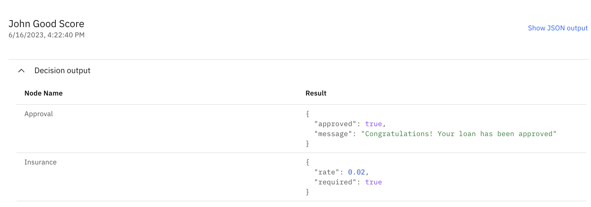

# Tutorial Quick: Using machine learning to make better decisions

## Description


This tutorial shows you how to connect an existing predictive model to a machine learning model deployed with a PMML file in an Automation Decision Services Machine Learning Service and use it in a decision service that validates loans. The decision service uses a decision model to apply policies and incorporate a risk prediction. These tutorial tasks are illustrated in the following diagram.


For more information on decision models and machine learning, see [Modeling decisions](https://www.ibm.com/docs/SSYHZ8_21.0.x/com.ibm.dba.aid/topics/con_modeling.html) and [Integrating machine learning](https://www.ibm.com/docs/SSYHZ8_21.0.x/com.ibm.dba.aid/ml_topics/con_integrate_ml.html).

For more tutorials about machine learning in Automation Decision Services see:
   - [Machine learning short tutorial](https://github.com/icp4a/automation-decision-services-samples/tree/21.0.2/samples/MachineLearningShortTutorial) to learn how to connect a predictive model to a Watson Machine Learning Model. 
   - [Machine learning complete tutorial](https://github.com/icp4a/automation-decision-services-samples/tree/21.0.2/samples/MachineLearningCompleteTutorial) to learn how to create predictive model, connect it to a Watson Machine Learning Model, deploy and execute the decision.
   - [Machine learning sample](https://github.com/icp4a/automation-decision-services-samples/tree/21.0.2/samples/MLDatasets) to get another example using two predictive models.
   - [Machine learning notebooks](https://github.com/icp4a/automation-decision-services-samples/tree/21.0.2/samples/MLNotebooks) to get another example of a notebook ready to be connected to a predictive model.
   
## Learning objectives

   - Define a machine learning provider using Open Prediction Service.
   - Import a PMML model directly in Decision Designer and connect it to an existing predictive model.
   - Run a decision model using this predictive model.

## Audience

This sample is for technical and business users who want to apply predictive analytics through machine learning in decision projects in Automation Decision Services. It also shows data scientists and data engineers how Automation Decision Services can be used to apply machine learning models in decision-making applications.

## Time required

15 minutes

## Prerequisites

Prepare with the following resources:
- [Getting started in Automation Decision Services](https://www.ibm.com/docs/SSYHZ8_21.0.x/com.ibm.dba.aid/gs_ddesigner_topics/dba_ddesigner_intro.html): This tutorial introduces you to Automation Decision Services.
- [Open Prediction Service API (OPS)](https://github.ibm.com/dba/ads-ml-service): This service allows to discover, manage and run models and deployments of a Machine Learning provider.

You must have the following environments:
- **Decision Designer**: A web-based user interface for developing decision services in Business Automation Studio. You work with the sample decision service by importing it into a decision project and opening it in Decision Designer.
- **Automation Decision Services Machine Learning Service**: A Machine Learning service implementation based on IBM Open Prediction Service API.

In this tutorial, you...
- Define a machine learning provider in a decision project.
- Upload a machine learning model by importing a PMML file. 
- Connect a predictive model to a machine learning model.


# Task 1: Defining a machine learning provider

**About this task**

In this task, you...
- Import and explore a sample project.
- Define a machine learning provider using Open Prediction Service.

## Step 1: Importing the sample decision service in Decision Designer

You import the sample decision service into a decision project. This decision service applies several criteria in determining a borrower’s eligibility for a loan.
One of the key factors is risk which is predicted by the machine learning model.

**Procedure**

1. Sign in to your instance of Business Automation Studio. Use the credentials provided for your instance.
2. Click on the navigation menu at the top left of the page, expand Design and select **Business automations**.
3. Click Decision to see the decision automations.
4. Click Create and select Decision automations to make a project.
5. Enter a name for the project. Use a unique name. Do not reuse the name of a decision project that already exists in your instance of Business Automation Studio. For simplicity, we use **Machine learning quick** in this sample documentation. After entering your name for the decision project, enter the following description:
`Automated Decision Service quick tutorial integrating machine learning prediction in a Loan Validation decision`. 
6. Click **Create** to make your decision project.
7. Click **Browse samples** in the project, and then select **Machine learning quick tutorial - Loan approval** in the Discovery section. 
8. Click **Import**: a decision service named **Quick machine learning loan approval** is added to your project. Click on it.
9. Open the data model to browse the defined types. Select `risk probabilities` that is used by the predictive model.
10. Click on the project name in the breadcrumbs and open the decision model `Loan Validation Decision Model`: it decides if a loan can be given to a borrower. One of the key decision is the risk computed in
the `Risk Score` node. It takes as input a prediction node corresponding to the `loan risk score` predictive model. The project may be in error, these errors will be fixed in Task 3.
11. Click **Quick machine learning loan approval** in the breadcrumbs and open the predictive model `loan risk score`. It is not yet connected, you'll connect it in next steps.
12. Click on the `Input mapping` node and look at the input mapping rule: it defines the machine learning model inout from a loan and a borrower.
13. Click on the `Output mapping` node and look at the output mapping rule: it defines a risk probability from the output of the machine learning model.

Next you will define a machine learning provider to connect the predictive model.


## Step 2: Defining a machine learning provider

You create a machine learning provider to get your model deployment into your decision project.See [Managing machine learning providers](https://www.ibm.com/docs/SSYHZ8_21.0.x/com.ibm.dba.aid/ml_topics/tsk_manage_providers.html) for more information.

**Procedure**

1. Go back to the diagram and click in the diagram outside any node or link.
2. Click on the **Connect** button. You see that no provider is defined.
3. Click on **New provider** to define one.
4. Click on **New +** to open the Machine Learning provider wizard:
   * Select `Open Prediction Service` as the type.
   * Set `ops-quick` as the name.
   * Enter the description: `Provider for the machine learning quick tutorial`.
   * Enter the URL of your Open Prediction Service instance. Click on the `Test connection` button. It should successfully connect.
   * Click on **Save** to add this provider. Wait for the Status to be Running to have this provider ready to be used in your project.
5. In the Navigation history click on `loan risk score` to go back to the predictive model.

Next you will connect your predictive model.

# Task 2: Importing a PMML file and connecting a predictive model.

**About this task**

In this task, you...
- Import a PMML file in Decision Designer.
- Connect a predictive model to a machine learning model.

## Step 1: Importing a PMML file 

You import a PMML file to create in Open Prediction Service a machine learning model deployment.

**Procedure**

1. Following Task 1, you are in the **Configure predictive model** wizard.
2. Click on **Select provider** and select the `ops-quick` provider you defined in Task1. You can see all the machine learning models deployed on this provider.
3. Click Import and select the PMML file provided in [`automation-decision-services-samples/samples/MachineLearningQuickTutorial/model/ML-Sample-SGDClassifier-StandardScaler-pmml.xml`](https://raw.githubusercontent.com/icp4a/automation-decision-services-samples/tree/21.0.2/samples/MachineLearningQuickTutorial/model/Predict%20loan%20default%20with%20PMML%20in%20WML.ipynb). 
4. Click on Import. A new machine learning model deployment is added: expand `SGDClassifier` a deployment `SGDClassifier` is ready to be used. 

Next you connect the predictive model to this machine learning model deployment.

## Step 2: Connecting a predictive model

You go on connecting the predictive model.

**Procedure**

1. Following Task 1, you are in the **Configure predictive model** wizard.
2. In the `Select machine learning model deployment` part select the deployment `SGDClassifier`.
3. Click **Next** to define the model input schema: it is complete, just browse it.
4. Click **Next** to define the test invocation. Click **Run** at the right of the wizard to validate the model. You get the following output:
```json
{
    "result": {
        "predicted_paymentDefault": 1,
        "probability_0": 0.17825993285555797,
        "probability_1": 0.821740067144442
    }
}
```
5. Click **Next** to define the model output schema. Select **Generate from test output**. Wait for the output schema to be generated and click on **OK**.
6. Click **Apply** to connect the predictive model to this machine learning model deployment. 

Next you run your predictive model and the decision model that calls it.

# Task 3: Running a predictive model and a decision model

**About this task**

In this task, you...
- Run a predictive model.
- Run a decision model calling a prediction node.

## Step 1: Running a predictive model 

You run the predictive model you connected in Task2.

**Procedure**
1. Following Task2, you are in the `loan risk score` diagram editor. Click on the Run tab. Two datasets are defined.
2. Select `John good score` and click on **Run**. The result is
```
{
  "payment default": 0,
  "probability": 1
}
```
There is no default payment risk with a probability of 1.
3. Browse in the Run history to see the executed rules.

Next you run the decision model calling this predictive model.

## Step 2: Running a decision model 

You run the decision model using the predictive model just defined. 

**Procedure**
1. Following Step1, you are in the `loan risk score` Run tab. 
2. In the Navigation history, select `Loan Validation Decision Model`. If the project is in error, you should do the following steps:
   - Remove the `loan risk score` predictive node.
   - Hover on the `Risk score` node and click on  **Add prediction**.
   - Select the predictive model `loan risk score.` There is no more errors.
3. Click on the Run tab and run the dataset `John good score`. You get the following results:

4. Browse the run history: the loan risk score rule has been triggered, the predictive model has called the machine learning model deployment.

You've completed this tutorial.
For more tutorials about machine learning in Automation Decision Services see:
   - [Machine learning short tutorial](https://github.com/icp4a/automation-decision-services-samples/tree/21.0.2/samples/MachineLearningShortTutorial) to learn how to connect a predictive model to a Watson Machine Learning Model. 
   - [Machine learning complete tutorial](https://github.com/icp4a/automation-decision-services-samples/tree/21.0.2/samples/MachineLearningCompleteTutorial) to learn how to create predictive model, connect it to a Watson Machine Learning Model, deploy and execute the decision.
   - [Machine learning sample](https://github.com/icp4a/automation-decision-services-samples/tree/21.0.2/samples/MLDatasets) to get another example using two predictive models.
   - [Machine learning notebooks](https://github.com/icp4a/automation-decision-services-samples/tree/21.0.2/samples/MLNotebooks) to get another example of a notebook ready to be connected to a predictive model.
