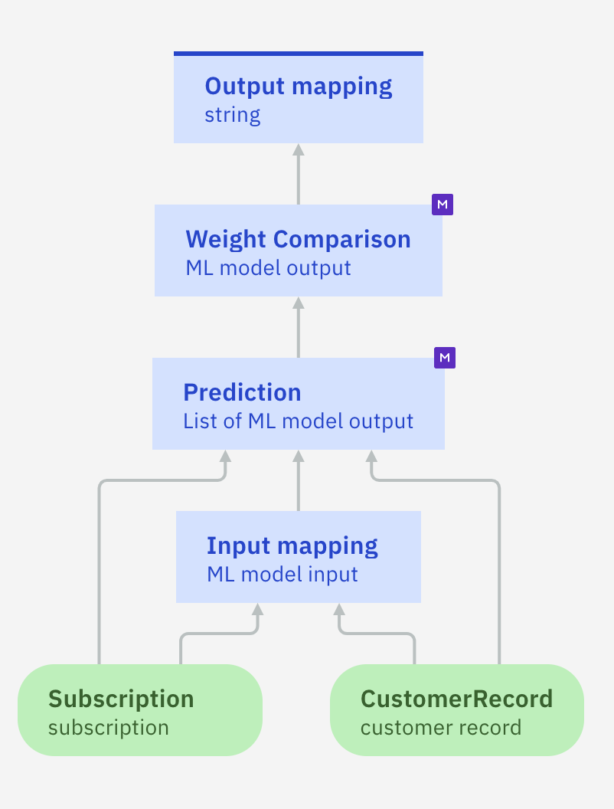

# Sample: Import PMML files to create transparent predictive models

This directory contains PMML files with rulesets. These files were generated using different algorithms from AI Explainability 360 and Watson Studio Modeler Flow ([SPSS Modeler](https://dataplatform.cloud.ibm.com/docs/content/wsd/spss-modeler.html)).

## Using PMML files with rulesets

The files can be directly imported into Decision Designer to generate a transparent predictive model. In a transparent predictive model, predictions are made by evaluating the imported rules -- whereas remote black-box models need to be invoked to return a prediction.

### Creating a transparent predictive model

You create a predictive model and configure it using a PMML file. For more details, see the `documentation`[](https://www.ibm.com/docs/en/cloud-paks/cp-biz-automation/24.0.0?topic=model-importing-transparent-machine-learning)[](https://www.ibm.com/docs/en/ads/24.0.0?topic=model-importing-transparent-machine-learning).
The first step is to download the PMML file to your machine. You explore it to see what data is required in the data dictionary part.
Then, open Decision Designer to import `Telecom` sample from the list of Industry samples:

   * Open `Customer retention` decision service. Explore different decision models especially Churn model using rules to calculate a customer churn probability.
   * Create a predictive model, e.g. `Transparent churn` in this decision service using the existing data model (i.e. Data) as data source.
   * Click `Configure`.
   * Select `Local machine learning` as the configuration method and click `Next`.
   * Browse to the PMML file [churn.pmml](./churn.pmml) on your machine or drag and drop it. 
   * Choose the decision logic generation method: by default it uses business rules. In some cases decision tables are more readable. Then click `Next`.
   * Map the input data from the pmml with the data in the churn data model except for RatePlan data field since the corresponding attribute in the data model has a different type. Then click `Apply`.
   
   * Explore the created predictive model: click the `Prediction` node and open the `Logic` tab to see the generated rules. 
   * Go back to the diagram.
   
Next, you have to complete the mapping of input data.
 
### Mapping input data
You check what input data is required and create a mapping rule or/and a decision table. Only `RatePlan` type is not mapped to a Customer retention data model type.
   * Define all the required input nodes and assign the correct data type to each one of them. The following screenshot shows the diagram complete with input nodes:
    
   * Click the `Input mapping` node and create a decision table named `rate plan mapping`. Select under Subscription drop list the rate plan of 'Subscription' as a condition column and click Create.
   * In `Customer retention` data model `rate plan` is an enumeration compared to double in the PMML churn model. The generated decision table should be as follows:
    

**Note**: The `ML model input` type is automatically generated from the PMML dictionary when the rules are imported. You can look at the content of the  `DataDictionary` section in the PMML file to see how it is defined. 

### Mapping output data
You create the output mapping rule.

   * Go back to the diagram and open the `Output mapping` node. In the `Details` tab, edit the Output type to number.
   * Go to the `Logic` tab, create a rule named `mapOutputData` and edit it in order to return the probability of churn being True. For example:
```
if the predicted of 'Weight Comparison' is "T" 
 then
 set decision to the confidence of 'Weight Comparison' ;
 else
 set decision to (1 - the confidence of 'Weight Comparison');
````
### Testing the predictive model

You run the predictive model to make sure it works as expected.
   * Open the `Run` tab and create a test data set. For example :
   ```
{
  "customerRecord": {
    "age": 35,
    "carOwner": false,
    "children": 1,
    "estimatedIncome": 100000,
    "gender": "Female",
    "location": "urban",
    "maritalStatus": "Single",
    "name": "Jane"
  },
  "subscription": {
    "internationalCalls": 0,
    "localCalls": 0,
    "longDistanceCalls": 0,
    "paymentMethod": "Auto",
    "ratePlan": "Basic",
    "usage": 50
  }
}
 
```
   * Run the model. It returns a prediction.
   
### Using predictive model in decision model
You use your newly created `Transparent churn` predictive model in your decision model.
   * Go to `Retention offer` decision model. Delete `churn` function node.
   * Create a new predictive node and set its type to `Transparent churn`. Link it to the `Retention monthly budget` decision node.
   * Select `Retention monthly budget` decision node, go to the Logic tab and edit size importance rule. Modify the part in error to use the `Transparent churn` predictive model instead of the churn decision model:
 ```
-- Get churn prediction from predictive model
set Churn to the transparent churn computed from 
	Subscription being Subscription , 
	CustomerRecord being Customer;
```
 * Run the model with the different datasets
## Files details
You can find some information about each file available in this directory below.

### Iris
This ruleset was built using the [iris.data](datasets/iris.data) and [iris.names](datasets/iris.names) data sets.
It predicts the family name of an iris depending on the length and width of the petals and sepals of the flower.

### Churn
This ruleset was built using the [churn.csv](datasets/churn.csv) data set.
It is used in the `Telecom` sample and predicts if a customer is likely to churn.

### LTVdiscrete
This ruleset was built using the [LTVdiscrete.csv](datasets/LTVdiscrete.csv) data set.
It is used in the `Telecom` sample and predicts a customer lifetime value. 

### Miniloan
This ruleset was built using the [miniloan.csv](https://github.com/DecisionsDev/decisions-on-spark/blob/master/data/miniloan/miniloan-decisions-ls-10K.csv) data set.
It predicts if a loan is likely to be approved.

### Wifi
This ruleset was built using the [wifi.txt](datasets/wifi.txt) data set.
It predicts the wifi signal in a specific location.
