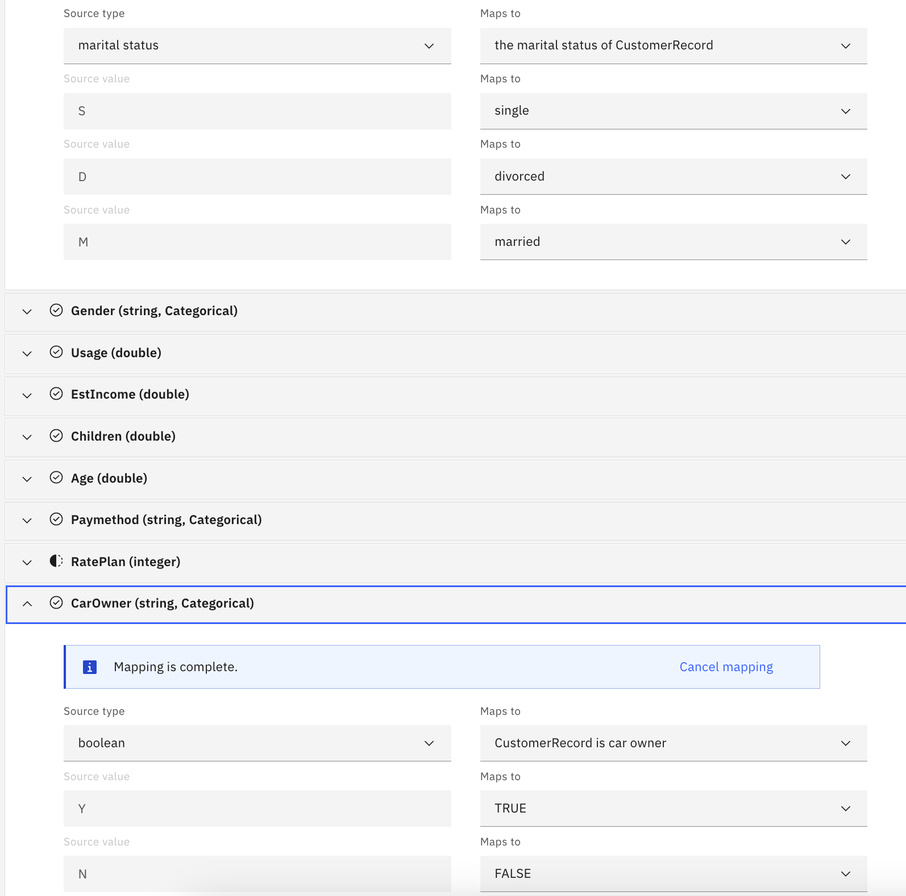
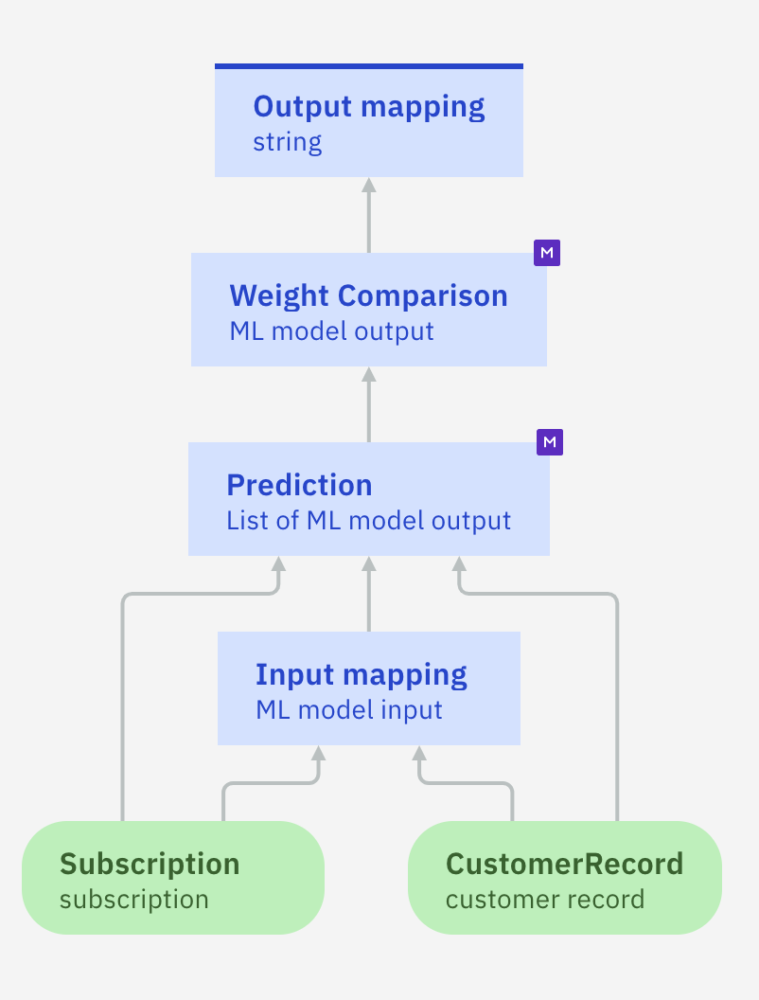
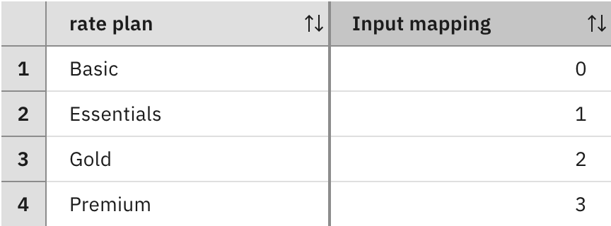

# Tutorial: Importing PMML files to create transparent predictive models
This tutorial shows you how to create a transparent predictive model using a PMML file with rulesets and to integrate it in decision service. It also provides several PMML files with rulesets. These files were generated using different algorithms from AI Explainability 360 and Watson Studio Modeler Flow ([SPSS Modeler](https://dataplatform.cloud.ibm.com/docs/content/wsd/spss-modeler.html)).
They can be directly imported into Decision Designer to generate a transparent predictive model. In a transparent predictive model, predictions are made by evaluating the imported rules -- whereas remote black-box models need to be invoked to return a prediction.

## Using a PMML file with rulesets

In this first part, you use the `Telecom` sample. It contains three decision services that decide how to retain customers and prevent churn:
   * `Customer retention` uses decision models based on rules.
   * `Transparent ML retention` uses transparent predictive models.
   * `Retention with ML`uses predictive models associated to a ML provider.

You work on the `Customer retention` decision service to replace a decision model that computes a churn rate based on rules by a transparent predictive model built with the `churn.pmml` file.
For more details, see the `documentation`[](https://www.ibm.com/docs/en/cloud-paks/cp-biz-automation/24.0.1?topic=model-importing-transparent-machine-learning)[](https://www.ibm.com/docs/en/ads/24.0.1?topic=model-importing-transparent-machine-learning).

### Step1: Exploring the decision service and the PMML file

In this step, you load the sample and explore the decision service.
   * Open Decision Designer to import the `Telecom` sample from the list of Industry samples.
   * Explore the data model to see which types are defined.
   * Explore the `Churn` decision model: it uses rules to calculate a customer churn probability.
   * Explore the `Retention offer`model: it relies on the `Churn` decision model to decides which offer is appropriate.
   * Download and explore the [churn.pmml](./churn.pmml) to see what data is required in the data dictionary part. This ruleset was built using the [churn.csv](datasets/churn.csv) data set.

### Step2: Creating a transparent predictive model

In this step, you create a predictive model and configure it using a PMML file. 

   * Open `Customer retention` decision service. 
   * Create a predictive model, e.g. `Transparent churn` in this decision service using the existing data model (i.e. Data) as data source.
   * Click `Configure`.
   * Select `Local machine learning` as the configuration method and click `Next`.
   * Browse to the PMML file `churn.pmml`you downloaded in the previous step.
   * Choose the decision logic generation method: by default it uses business rules. In some cases decision tables are more readable. Then click `Next`.
   * Map the input data from the pmml with the types defined in the data model when it is possible. Note that you cannot map the `RatePlan`data field to the corresponding type in the data model because it is different. You will define a mapping rule in the next step. Then click `Apply`.
   
   * Explore the created predictive model: click the `Prediction` node and open the `Logic` tab to see the generated rules. 
   * Go back to the diagram.
 
### Step3: Mapping input data
In this step, you check what input data is required and create a mapping rule or/and a decision table. Only `RatePlan` type is not mapped to a Customer retention data model type.
   * Define all the required input nodes and assign the correct data type to each one of them. The following screenshot shows the diagram complete with input nodes:
    
   * Click the `Input mapping` node and create a decision table named `rate plan mapping`. Select under Subscription drop list the rate plan of 'Subscription' as a condition column and click Create.
   * In the `Customer retention` data model `rate plan` is an enumeration compared to double in the PMML churn model. The generated decision table should be as follows:
    

**Note**: The `ML model input` type is automatically generated from the PMML dictionary when the rules are imported. You can look at the content of the  `DataDictionary` section in the PMML file to see how it is defined. 

### Step4: Mapping output data
In this step, you create the output mapping rule.

   * Go back to the diagram and open the `Output mapping` node. In the `Details` tab, edit the Output type to number.
   * Go to the `Logic` tab, create a rule named `mapOutputData` and edit it in order to return the probability of churn being True. For example:
```
if the predicted of 'Weight Comparison' is "T" 
 then
 set decision to the confidence of 'Weight Comparison' ;
 else
 set decision to (1 - the confidence of 'Weight Comparison');
````
### Step5: Testing the predictive model

You run the predictive model to make sure it works as expected.
   * Open the `Run` tab and create a test data set. For example :
   ```
{
  "customerRecord": {
    "age": 35,
    "carOwner": false,
    "children": 1,
    "estimatedIncome": 100000,
    "gender": "Female",
    "location": "urban",
    "maritalStatus": "Single",
    "name": "Jane"
  },
  "subscription": {
    "internationalCalls": 0,
    "localCalls": 0,
    "longDistanceCalls": 0,
    "paymentMethod": "Auto",
    "ratePlan": "Basic",
    "usage": 50
  }
}
 
```
   * Run the model. It returns a prediction number: the probability of the custormer to churn.
   
### Step6: Using the transparent predictive model
In this step, you use your newly created `Transparent churn` predictive model in the `Retention offer` decision model.
   * Open to `Retention offer` decision model. Delete `churn` function node.
   * Create a new predictive node and set its type to `Transparent churn`. Link it to the `Retention monthly budget` decision node.
   * Select `Retention monthly budget` decision node, go to the Logic tab and edit size importance rule. Modify the part in error to use the `Transparent churn` predictive model instead of the churn decision model:
 ```
-- Get churn prediction from predictive model
set Churn to the transparent churn computed from 
	Subscription being Subscription , 
	CustomerRecord being Customer;
```
   * Run the model with the different datasets to get which offers are proposed according to the predictive churn.

## Other PMML files

This second part lists the PMML files samples in this directory. They can be used to build a transparent predictive model. You have to define a mapping input and output to be able to use them as described in the first part. Here are the details.

### Iris
This ruleset was built using the [iris.data](datasets/iris.data) and [iris.names](datasets/iris.names) data sets.
It predicts the family name of an iris depending on the length and width of the petals and sepals of the flower.

### Churn
This ruleset used in the first part was built using the [churn.csv](datasets/churn.csv) data set.
It is used in the `Telecom` sample and predicts if a customer is likely to churn.

### LTVdiscrete
This ruleset was built using the [LTVdiscrete.csv](datasets/LTVdiscrete.csv) data set.
It is used in the `Telecom` sample and predicts a customer lifetime value. 

### Miniloan
This ruleset was built using the [miniloan.csv](https://github.com/DecisionsDev/decisions-on-spark/blob/master/data/miniloan/miniloan-decisions-ls-10K.csv) data set.
It predicts if a loan is likely to be approved.

### Wifi
This ruleset was built using the [wifi.txt](datasets/wifi.txt) data set.
It predicts the wifi signal in a specific location.
